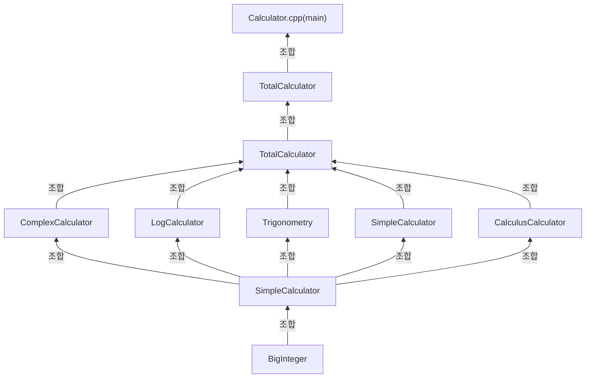

- 공학용 계산기 설계
- 내부함수는 모두 STL사용을 최소화하며, 최단 시간 알고리즘을 기준으로 작성
- 추후에 앱, 웹에서 구동가능할 여지를 남기고, AI가 사용될 가능성도 남겨야함
- 완성시 Docker을 활용한 배포

# 설계

- BigInteger을 사용하여 공학계산기에 맞는 정수형을 내포할 수 있도록 만들기
- 공학계산기인 만큼 다양한 수학을 지원할 수 있도록 클래스 나누기(로그함수, 이산수학 등등 다양한 클래스로 쪼개 유지보수를 편하게 하기)
- main함수 설계 후 추후에 DrawingGraph등의 클래스에 상속하여 기능 다양성을 살리기

# Class

- 추후 유지보수를 위해 클래스를 다양하게 나눔
- 추가로 클래스 각각이 긴 코드로 인해 헤더파일도 나누어서 작업 -> 추후 유지보수 용이

---

- ## BigInteger
	- long long int로 표현 불가능한 정수형을 표현하기 위해 만든 java의 BigInteger와 동일한 효과
	- 음수처리, 선행0처리 등 다양한 기능 통해 사용자의 입력이 다르더라도 일관된 정수형을 출력하게 도움
	- SimpleCalculator - sqrt, square, factorial등의 메서드 지원이 목표

-----

- ## SimpleCalculator
	- BigInteger을 상속이 아닌 조합을 통해 기능을 받음(결합도가 높아지는 것을 방지하기 위함 + 다중 상속 방지 --> 단일상속 유지)
	- 간단한 사칙연산을 지원
	- sqrt, square, factorial 등 ComplexCalculator, LogCalculator등의 기능지원을 위해 필요한 수학함수들을 직접 제작

-----

- ## ComplexCalculator
	- 