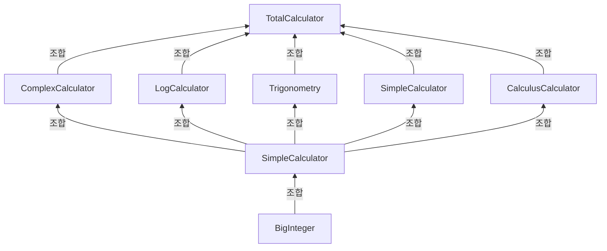

- 공학용 계산기 설계
- 내부함수는 모두 STL사용을 최소화하며, 최단 시간 알고리즘을 기준으로 작성
- 추후에 앱, 웹에서 구동가능할 여지를 남기고, AI가 사용될 가능성도 남겨야함
- 완성시 Docker을 활용한 배포

# 설계

- BigInteger을 사용하여 공학계산기에 맞는 정수형을 내포할 수 있도록 만들기
- 공학계산기인 만큼 다양한 수학을 지원할 수 있도록 클래스 나누기(로그함수, 이산수학 등등 다양한 클래스로 쪼개 유지보수를 편하게 하기)
- main함수 설계 후 추후에 DrawingGraph등의 클래스에 상속하여 기능 다양성을 살리기

