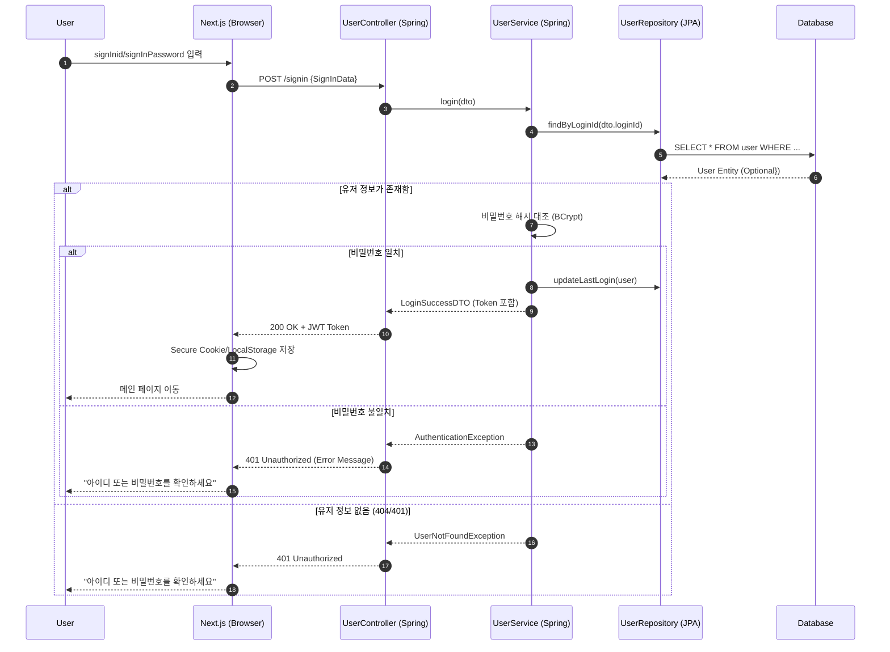

```mermaid
sequenceDiagram
    autonumber
    participant User
    participant Next as Next.js (Browser)
    participant Ctrl as UserController (Spring)
    participant Svc as UserService (Spring)
    participant Repo as UserRepository (JPA)
    participant DB as Database

    User ->> Next :  signInid/signInPassword 입력
    Next ->> Ctrl :  POST /signin {SignInData}
    Ctrl ->> Svc :  login(dto)
    Svc ->> Repo :  findByLoginId(dto.loginId)
    Repo ->> DB :  SELECT * FROM user WHERE ...
    DB -->> Repo :  User Entity (Optional})
     alt  유저 정보가 존재함
        Svc ->> Svc :  비밀번호 해시 대조 (BCrypt)
         alt  비밀번호 일치
            Svc ->> Repo :  updateLastLogin(user)
            Svc -->> Ctrl :  LoginSuccessDTO (Token 포함)
            Ctrl -->> Next :  200 OK + JWT Token
            Next ->> Next :  Secure Cookie/LocalStorage 저장
            Next -->> User :  메인 페이지 이동
         else  비밀번호 불일치
            Svc -->> Ctrl :  AuthenticationException
            Ctrl -->> Next :  401 Unauthorized (Error Message)
            Next -->> User :  "아이디 또는 비밀번호를 확인하세요"
         end 
     else  유저 정보 없음 (404/401)
        Svc -->> Ctrl :  UserNotFoundException
        Ctrl -->> Next :  401 Unauthorized
        Next -->> User :  "아이디 또는 비밀번호를 확인하세요"
     end 
```
