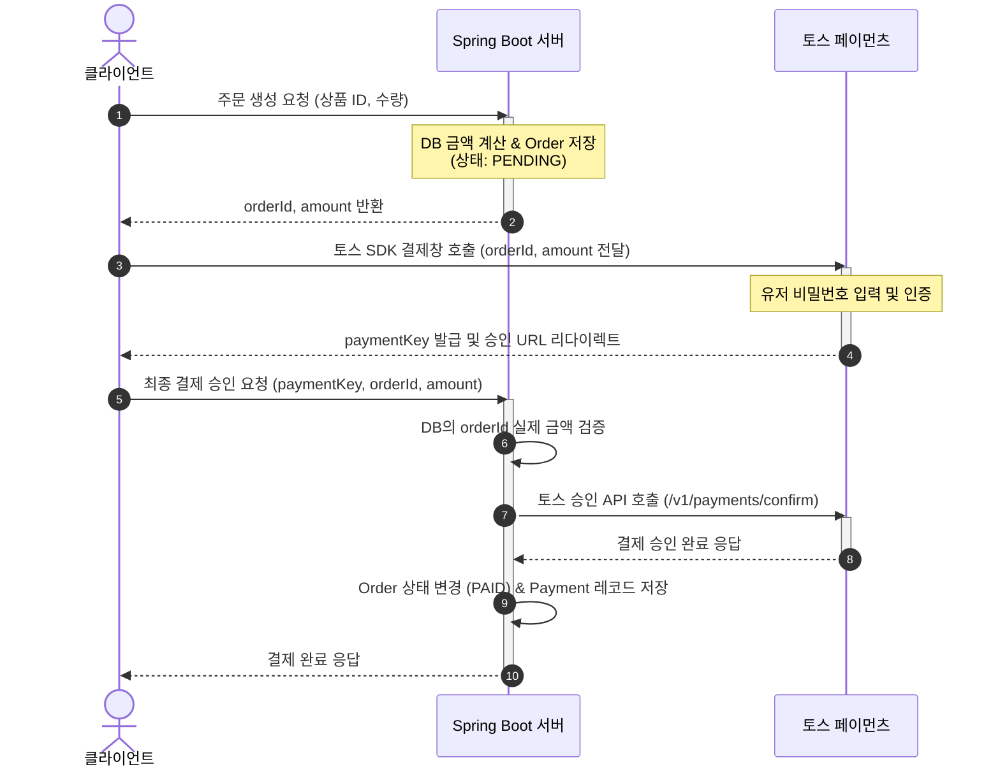

---
tags:
  - seed
aliases: []
created: 2026-08-07
---

# 20260729 ~ 20260804
전체적인 흐름을 잡았다.

기본적으로 backend 구현은 spring boot를 통해 직접구현을, frontend구현은 추후에 claude와 같은 ai agent를 통해 구현을 할 계획이다.

따라서 6개월의 기간을 목표로 잡고, backend -> frontend -> test -> 배포의 과정을 거칠 계획이다.

#### 금주 할일
- [x] harness rule setting : copilot-cli는 github student pack을 가입한 github pro 사용자들에게 무료로 제공되는 토큰이 존재한다. 이는 적은 양이지만 성능이 꽤 좋은 편이라고 생각해서 전반적으로 주간 스케줄을 작성하고, 구현에 이상이 존재하는지 등을 부트캠프의 강사 입장에서 확인할 수 있도록 설정하였다.
- [x] Data structure : 쇼핑몰에서 기본이 되는 user, cart, product, order의 데이터 스키마를 설계하고, 이를 entity class로 표현하는 것을 목표로 둔다.
- [x] DTO structure : 위 데이터 스키마 설계에서는 중요한 user, cart, product, order 데이터의 뼈대를 설계하였는데, 추가적으로 api를 통해 json파일을 받을 때, 응답을 할 때 등의 과정에서 필요한 dto를 설계하였다.
- [x] global config : Global Exception Handler와 ErrorCode를 통해 발생가능한 예외상황을 정의하고, HttpStatus를 상황별로 고정시켜 반환할 수 있도록 구현
- [x] API Response : API 요청이 들어온 경우, 정해진 양시에 따라 응답을 할 수 있도록 ApiResponse 클래스 작성
- [x] Constant : 테이블 이름과 같은 상수를 따로 저장하고, 추후 필요에 따라 컬럼의 이름을 기존 엔티티 필드와 다르게 설정할 경우 매핑될 수 있도록 작성할 것인지 판단, api url을 상수로 뺄 것인지도 판단.
- [x] 추가) CheckConfig : 앞선 엔티티 구현에서 NPE체크, 문자열의 경우 Blank 확인, 수량과 같은 정수는 음수 확인 등 값들의 확인이 중복되는 것을 확인하고, 이를 CheckConfig에 메서드로 정의하여, 통합된 방식으로 확인

#### 트러블
1. NPE : null pointer exception이라는 뜻으로, db에 table을 생성할때, column을 정하게 되는데, 이때 column 어노테이션과 nullable의 조합으로 해당 컬럼에 null을 허용할 것인지 쿼리를 자동 설정할 수 있다. 그 외에도 dto -> entity로 데이터 변환 작업이 이뤄질 경우, null에 대한 참조가 발생할 때, null pointer 참조에 대한 예외처리를 확실하게 하여 서버가 다운되는 일을 방지한다. (때때로 dto에 null을 의도적으로 허용하여 dto가 원하는 데이터를 담을 수 있도록 설정한 경우도 존재하기에 꼼꼼하게 살핌)
2. Harness file : 하네스 파일은 ai agent가 작업을 실행할 때, 어떤 작업을 어떤 위치에서 실행하는지 등을 정확하고 상세하게 명시해주는 것이 좋다. 이때 너뭄 세세하게 명시하다 보면 충돌이 일어나는 개념이 존재할 수 있는데, 내가 작성한 하네스 파일을 예시삼으면, 저번주 목표 기술적 문제 확인 -> 기능적 문제 확인 -> 전체적인 흐름에 따른 다음 한주 동안 목표 설정의 과정을 obsidian vault내부 copilot-addendum.md파일에 서술하라고 명시하였는데, 이때 날짜를 위에서는 하루단위로 설정하고, 밑에서는 1주일의 단위로 설정하니 혼돈이 생겨서 어쩔때는 하루 단위, 어쩔때는 일주일의 단위로 설정되는 것을 확인 할 수 있었다. 따라서 본인의 의도대로 ai agent를 작동시키기 위해서는 전체적으로 서술을 한 후, 자신의 의도가 다 담겨있는지 확인한 후, 충돌되는 부분이 존재하는지 확인한 후, 시험삼아 몇 번 돌려보는 것이 좋은 것 같다.
3. Data type : 기존 정수의 타입을 Integer로 통일을 했었는데, 이를 Long으로 바꾸게 되었다.
	1. 데이터의 범위가 Integer은 약 21억까지 지원을 하기에 충분할 것으로 생각을 하였는데, 주문정보나 장바구니에 담는 물건 정보등은 Integer로 설계될 경우 빠르게 찰 것으로 생각되어 Long으로 바꾸게 되었다.
	2. JPA 및 Spring Data JPA의 기본 예제와 표준 엔티티 인터페이스에 따르면 Long타입으로 작성이 되었다.
	3. 외부 PG사와의 결제 기능을 추후에 넣을 예정인데, 이때 Long/BigInt를 기준으로 삼는 시스템이 많다.
	4. MySQL의 BIGINT타입과 Long타입이 1:1로 대응된다.
4. 데이터 체크 : 데이터를 체크할 때, string의 경우 npe + isblank의 조합으로 유효성 검증, 수량과 같은 정수는 npe + negative 조건문으로 확인 등 데이터 유효성 검증에 코드가 겹치는 경우가 발생하였고, 이를 Exception Handler처럼 따로 데이터 검증 클래스에 메서드로 구현하여 보일러 플레이트 코드를 최소화함.
5. 단방향 / 양방향 매핑 엔티티 : JPA(Hibernate)를 통해 User는 user_id에 1:1매핑되는 카트를 객체로 갖게 하거나, cart는 cartitem을 1:N관계로 양방향 매핑하는 등의 관계를 구현하는 과정에서 필요한 어노테이션(Joincolumn, onetomany, onetoone 등)을 이해하고, orphanremoval과 같은 고아 객체 삭제, cascade 설정을 통한 영속성 전이(cartitem의 수정시 cartitemlist에 영향을 미치도록 설정), fetchtype.lazy를 통한 지연설정 등을 설정하고, 해당 설정 과정에서 totalprice와 같이 product의 업데이트에 따라 cartitem의 curproductitem 필드에 영향을 미쳐 totalprice가 변하는 방식등을 어느 부분에서 이뤄지도록 할 것인지 설정하였다.


# 20260805 ~ 20260811

이번주의 전반적인 목표는 기본적인 Controller + Service를 통해 기본적인 CRUD를 추가하고, 이 과정에서 API URL을 Swagger-ui의존성을 추가하여 설정하는 것이 목표

#### 금주 할일
- [/] Controller & service 구현 : 야그니 원칙에 따라 시나리오를 구상하고, 이에 필요한 4개의 엔티티에 대한 CRUD 기능과 Http method 구현
-> user, product에 대한 구현은 마무리 하였지만, cart/product는 미흡
- [x] Api 명세서 & url 설정 : swagger-ui 의존성 추가와 swagger-ui를 통한 api명세서 확인

#### 트러블
1. 데이터 유효성 : 전 주에 데이터 유효성을 한 클래스에 메서드로 구현하여 보일러 플레이트 코드를 줄이려고 노력했는데, 이전에 구현된 Entity & dto에 적용안된 코드들이 다수 존재했고, 이를 수정함. 따라서 앞으로는 중간에 특정 기능을 대체하는 코드를 구현하게 될 경우, 이전 코드들을 즉각적으로 리펙토링하는 습관이 필요
2. cart 정보 조회 문제 : cart정보를 조회하여 장바구니 확인 -> 주문 생성 + 결제의 흐름으로 시나리오를 설계하였지만, 이 과정에서 문제가 발생함. cart정보를 조회하는 과정에서 cartItem의 curProductPrice와 같은 값들을 productId와 매핑하여 갱신하도록 할 계획이였지만, 이는 큰 딜레이를 가져오게됨. 따라서 redis와 같은 인메모리에 curProductPrice를 직접적으로 저장하는 방식이 아닌, product정보를 올리고, 이를 productId로 조회만 할 수 있도록 하여 CUD의 작업을 최소화하는 방식으로 구현할 수 있도록 목표를 새로 잡았고, redis를 사용해본 경험이 전무하기 때문에, 이를 이해하고, 구현할 수 있도록 다음 주에 진행할 예정(설계의 중요성을 다시 한번 파악함)
3. 결제 방식 : kakaopay, tosspay 등의 PG사의 api를 통한 결제를 진행하도록 목표를 잡았는데, 요청과 받는 응답을 처리하는 기능 등을 구현하는게 너무 복잡함. 따라서 다음 주에는 tosspay를 기준으로 결제를 진행하도록 목표를 잡음.
4. api url 설계 : url은 접근할 자원의 경로를 적어주는 것이기에 create나 get 등의 기능적인 단어를 넣지 않음.
-> 다음주 개발 목표에 redis + tosspay를 추가하고, 기본적인 쇼핑몰의 틀이 잡히게 되면, next.js를 통한 webserver 구현 + ui기본적인 틀을 짜는 방향으로 진행. 이후에는 CI/CD와 docker + kubernetes를 추가하여 백엔드의 추가되는 기능과 이에 대한 ui를 github action으로 배포하는 것을 연습할 계획

# 20260812 ~ 20260818

이번주는 저번주 트러블 슈팅에서 알 수 있듯이 redis 적용 + cartItem 수정, tosspay 결제 방식 추가가 주된 내용이다. 추가적으로 Session방식과 JWT방식을 고민했었는데, 무상태성을 통해 DB의 부담을 줄일 수 있는 JWT를 선택하였다. (물론 추후에 블랙리스트 기능을 추가하게 되면 이는 무상태성에서 벗어난다고 생각은 하지만, 현재 상태성을 구현하는 방식은 JWT로 해결할 수 있을 것 같아 JWT를 선택하게 됨.)

#### 금주 할일
- [x] redis 공부 + 적용하여 cart controller & service 구현 완료하기
- [x] tosspay 결제 방식 도입하여 order controller & service 구현 끝내기
- [x] 모든 controller의 http method 요청 방식을 JWT로 통일시키기




``` title="tomcat실행 및 spring security를 통한 servlet filter chain 실행 흐름"
[1. 클라이언트 요청] 
  │ (HTTP Request / Port 8080)
  ▼
[2. Tomcat (서블릿 컨테이너)]
  │ - TCP/IP 소켓으로 요청 수신
  │ - Worker Thread 할당 및 HttpServletRequest 객체 생성
  ▼
[3. Tomcat의 서블릿 필터 체인 실행]
  │ - DelegatingFilterProxy 실행
  ▼
[4. Spring Container (Spring Security 영역)]
  │ - DelegatingFilterProxy가 FilterChainProxy(Bean)에게 위임
  │ - SecurityFilterChain 내의 필터들 실행 (JwtAuthenticationFilter, AuthorizationFilter 등)
  │ - 검증 실패 시: 즉시 401/403 예외 응답 반환 및 종료
  ▼ (모든 보안 필터 통과 시)
[5. DispatcherServlet (Spring Front Controller)]
  │ - URL 매핑 확인 후 적절한 @RestController 메서드 호출
  ▼
[6. Controller -> Service -> DB 비즈니스 로직 수행]
  │
  ▼ (응답 생성 후 역순으로 복귀)
[7. DispatcherServlet -> Security Filter (후처리) -> Tomcat -> 클라이언트]
```
#### 트러블
1. redis : redis는 인메모리 dbms로 mysql과 달리 디스크가 아닌 ram에 데이터를 저장, 이때 적은 용량으로 인해 조회를 많이 요구하게 되는 데이터를 주로 넣게 된다. 주로 다음과 같은 패턴을 많이 사용함
	1. cache-asside : 조회 작업에 대해 캐시 메모리(redis)를 우선 조회 후 캐시 미스인 경우 디스크(mysql)를 조회하게 됨.
	2. write-around : CUD작업은 바로 디스크(mysql)에서 작업하고, 캐시에 존재하는 데이터의 수정은 바로 반영되지 않음(patch로 인해 발생하는 비용이 커질수도 있기 때문) -> 데이터의 일관성을 해칠 수 있는데 이는 redis의 TTL설정을 통해 어느정도 보완(TTL이 만료되기 전에 UD작업이 발생한 데이터에 대해 조회가 발생한 경우, 일관되지 않은 데이터를 가져올 수 있기 때문에, redis에서는 어느정도 일관성을 해쳐도 기능에 지장이 생기지 않는 데이터를 보관하는 것을 추천함)
	- 위 두 규칙을 적용하여 product같은 정보를 올려서 보관하려고 했지만, 다음과 같은 문제가 발생할 가능성이 높음 
		1. 수량 관리가 매우 힘듬 : 수량에 민감한 쇼핑몰의 특성상 UD작업을 진행하고 이를 write-around에 따라 저장할 경우, 존재하지 않는 수량에 대한 주문 정보가 생성될 수도 있음
		2. 1.의 이유로 데이터의 일관성이 매우 민감하게 작용
		따라서 현재 단계에서는 jwt-refreshToken만 저장하고, 인증 시에만 조회하도록 설정. 추후에 redis에 올릴 데이터를 고민하고, sql튜닝 이후에 적용할 수 있도록 계획해야함.
2. JWT : jwt를 설정하면서 http 통신에 어떤 정보들이 존재하는지 파악, 이때 통신 방식에 따라 헤더 내 authorization 방식을 달리할 수 있음을 파악함. 현재는 bearer방식(authorization에 "Bearer " + jwt를 보내도록 약속하는 규칙)을 통해 구현.
	- http request는 다음과 같은 구조를 가짐
		- http method : post / get / patch / put / delete
		- url : 접근할 자원의 주소
		- header : 요청을 보내는 주체의 마이데이터를 담은 정보로, 주로 host / authorization / content-type이 존재
		- body : 기능에 필요한 데이터들을 담은 정보
3. Spring Security : 가장 어려운 부분이였는데, 서블렛이라는 개념과 서블렛 필터, 서블렛 필터 체인을 통해 spring security의 동작 방식, HTTP Request가 WAS에 도착했을 때, 전처리/후처리 작업이 어떤식으로 이뤄지는지 파악. 특히 인증의 필요 유무에 따라 public/private method api url을 설정하는 과정이 매우 어려웠음(원리도 어렵고 url을 어떤식으로 설정해야 인증이 필요한 요청만 인증을 요구하도록 필터를 설정하도록 구현하는 것이 어려웠음). 
	- 서블렛 필터 체인 : 서블렛 컨테이너(http request를 받아 http response를 만들어주는 클래스 : 서블렛을 보관해놓은 컨테이너, spring boot에서는 tomcat을 의미)가 http request를 받을 때, 전처리작업과 후처리 작업을 진행하는 것을 서블렛 필터라고 하고, 이를 재귀 함수 형식으로 여러 필터를 연쇄적으로 호출하는데, 이때 후처리는 전처리의 역순으로 이뤄지는 일련의 작업을 서블렛 필터 체인이라고 함.
4. Authorization : 위에서 필터를 통해 토큰의 유효를 전처리로 확인했었는데, 이때 jwtprovider를 통해 토큰의 유효를 secret key와 대조하여 확인하게 함. 중요한 것은 추후에 http 요청방식을 사용하지 않은 곳에서도 jwtprovider을 통해 token의 인증을 요구할 수도 있기 때문에 전적으로 httpservletrequest에서 뽑은 access token을 문자열로 받아 판별 및 예외처리만 하는 로직을 작성
5. Cookie : 매번 jwt를 보관 및 인증이 필요한 요청 시 보내주는 것은 때때로 오류를 일으킬 수도 있기 때문에, 자동으로 jwt를 보내도록 웹 브라우저 측에서 관리하는 방식이 cookie이고, 이는 자동으로 보내준다는 이점이 존재함. 필터의 입장에서는 쿠키로 받는 경우도 존재하지만, 쿠키 설정 허용을 하지 않은 사용자는 jwt를 수동으로 보내주게 되고, 따라서 쿠키로 토큰을 뽑는 방식과 header에서 바로 토큰을 뽑는 두 가지의 방식을 모두 지원해야됨. 따라서 extractToken에서 cookie에서 추출 방식 + Bearer에서 추출하는 방식을 모두 지원하도록 변경
6. 권한 부여 : 권한(현재는 관리자 / 사용자로만 분류)을 통해 접근가능한 기능들을 분류해야만 하고, 이는 securityconfig에서 url별 필터적용이 필요하다고 생각함(추후에 권한이 추가되거나, 권한별 기능을 세세하게 분류하게 되어야 할 경우, 주의해서 설정해야 함)
7. Repository : 현재 모든 repository는 Jparepository를 상속하여 기본적인 crud기능을 jpa가 자동으로 매핑할 수 있도록 설정하였는데, return type에 optional로 감쌀 것인지 판단하는 방식을 배움. -> 기본적으로 단일 Entity 객체를 반환하는 경우 찾지 못한 경우 null값처럼 없음을 표현하는 값을 반환해야하고, 이때 java에서는 기본 타입에 Null이 적용되지 않고, 기본값이 적용됨. 만약 Entity의 기본생성자를 통해 모든 필드를 null로 채웠을 경우(물론 개발자가 noargsconstructor 어노테이션이나 기본생성자를 구현했다는 가정이 필요), column 어노테이션 nullable 속성을 통해 null값을 허용하지 않으므로 오류가 발생, 허용한다고 해도 추후에 getter을 통해 조회할 경우 npe problem이 발생할 수 있기 때문에 optional에 감싸 개발자가 orelsethrow를 통한 예외 던지기를 강제구현하게 함. 하지만 findall과 같이 list 래퍼 객체는 빈 리스트라는 null을 표현가능한 대체재가 존재하기 때문에 optional로 감쌀 필요가 존재하지 않고, 감싸더라도 jpa가 자동으로 db 조회 쿼리 결과로 null을 받으면 빈 리스트를 만들기 때문에 orelsethrow가 실행되지 않음.
-> 0/1개의 반환타입만 존재하면(단일 entity 객체 반환형) Optional로 감싸고, 0...n개의 반환타입(List T 반환형)인 경우 optional 불필요.(실제로 findAll()은 jparepository내부에서 List T 반환형으로 구현).
8. servlet container prefix url : application.yml 설정 파일에 prefix url을 설정(/api/v1과 같이 웹서버와 분류하는 url을 prefix로 구현하여 서버를 나누기 위함). 추가적으로 context-path를 통해 WAS에 들어오는 prefix url을 설정했는데 이는 requestmapping시 prefix url을 제거하고 뒤에 url을 제공한다는 의미이다. sercurityconfig에서 request machers를 사용할 때, prefix url을 제거해야 실질적으로 api url을 매핑시킬 수 있기 때문에 (제거하지 않은 경우 prefix url + prefix url + api url로 들어온다고 machers는 간주하는 것이다.) 이를 제거.
9. payment : 가장 어려운 것은 Toss api를 통해 결제를 진행해야 하는데 어떻게 흘러가는지 파악하는 것이였다. 특히 결제 성공 후 product 수량을 컨트롤하거나, 결제 이전에 수량이 존재하는지 등을 체크하고, 결제 내역과 결제 금액등을 api url로 어떻게 요청해야하는지 자세히 몰라 한참을 toss dev 사이트 내 게시된 결제 관련 api 글을 읽어야 했다. 경험으로 느낀 바를 말하자면, 대부분의 PG사 결제 방식은 위 시퀀스 다이어그램의 방식대로 흘러갈 것이고, WAS를 개발하는 입장에서는 다음과 같은 주의사항을 바탕으로 구현 순서를 정하는 것이 중요하다고 생각한다.
	1. 처음 주문을 생성해서 결제 이전의 상태로 orderId + amount(결제 금액)을 반환할 때, 제품의 수량을 확인하는 로직을 작성해야함(이때문에 product 조회가 많아 redis에 올리는 것을 고민하게 되었다.)
	2. 이후 웹서버 측에서 paymentkey + 승인 url을 받아오게 되면(실제로는 사용자 입장에서 인증 + 결제까지 끝난 상태이다.) WAS에서는 결제를 확정짓기 전에, 결제 금액이 일치하는지 확인을 진행해야함. 이때 받아온 paymentkey를 통해 toss에 결제 정보 조회 api 요청을 날림. 
	3. 결제를 확정(상태를 결제 확정 상태로 변경)한 후 저장
	위 주의사항을 바탕으로 다음과 같은 순서로 개발하는 것이 매우 편했다.
	- dto 구현 : toss dev api guide에 따르면 결제가 성공했을때에는 payment, 실패한 경우는 error 객체를 반환하니까, 가이드에 따라 record를 만들어 관리
	- api key 발급 및 url 적용 : api key를 발급받아 환경변수에 적용하고, 가이드에 따른 url을 설정한다.
	- 기능 개발 : 결제 과정에서 WAS가 진행해야 하는 기능들을 기능별로 service 레이어에 구현. 현재 수량 차감 기능이 구현되지 않았는데, 추후에 리펙토링하면서 수량 차감 기능을 트랜잭션으로 구현해야 함.
	payment과정을 진행하면서 흐름을 알더라도 암호화나 각 흐름별 기능들을 어떤식으로 구현해야 하는지 막막했고, 이는 LLM의 도움을 적극적으로 받음. 추후에 다른 PG사와의 결제 연동을 구현할 때(kakaopay, naverpay 등), 카피코드를 통해 얻은 경험으로 적은 LLM의 도움으로 구현할 수 있을거라고 판단했기 때문이다.
10. Service 레이어 구현 : service레이어에서 다른 service를 참조했는데, 서로를 참조하는 경우가 발생했고, 이때 순환 참조 문제가 발생하며 오류(BeanCurrentlyInCreationException)가 발생했었음. 따라서 service레이어에서 해당 Entity가 아닌 다른 Entity를 건드려야 하는 경우, service를 참조하는것과 repository를 참조하는 것이 BeanCurrentlyInCreationException오류를 유발하고, 성능차이가 발생하지 않는 것을 인지하고, repository를 참조할 수 있도록 구현함.
11. 기타 버그 : patch/delete order에서 소유권 검증(권한 검증 + 사용자 권한이여도 해당 주문내역에 대한 소유권이 존재하는지 판단) 로직이나 securityconfig의 /users/** 추가(모든 개인 정보를 조회하거나 변경하는 작업에 jwt를 통한 인증이 필요하기에 추가), hasRole 규칙 순서를 후순위에 두어 규칙이 무효화된 점을 규칙 순서 교체로 고침 등이 존재함.
→ 굉장히 어려운 한 주였고, 이는 이전에 구현해보지 못한 점들을 구현하고, 그 과정에서 원리는 이해해도 코드로 옮기는 과정도 꽤나 어려웠다고 생각함. 특히 security나 filter, encoding등 알지 못했던 spring security api들을 적용해서 구현하고, http request의 원리를 파악하며 jwt/cookie 세팅하는 것이 어려웠음. 현재 인증이 필요함에도 jwt / cookie가 적용되지 않은 부분들이 존재할 수도 있지만, 다음 주 일정 E2E시나리오 점검(전체적으로 사용자가 쇼핑몰에 적용할 수 있는 주요 기능들의 시나리오를 순서대로 따라가며 구현이 정확하게 되어있는지 확인) + 웹 서버 뼈대 세우기를 진행하고, CI/CD 구현 및 docker/kubernetes를 구현하게 되면, CI/CD로 리펙토링과 추가 기능구현을 할 예정인데, 이때 미뤘던 상품 재고 처리 로직이나 인증 로직 점검을 우선적으로 진행할 계획이다.

# 20260819 ~ 20260825

해커톤 일정이 2일 잡혀있기 때문에 5일의 시간을 기준으로 스케줄을 짰고, 이번주는 웹서버의 본격적이 구현 이전에 뼈대를 세우고, WAS의 현재 구현된 기능들을 전체적인 시나리오를 통해 점검하며 리펙토링을 갖는 기간이 됨. 추가적인 기능은 위에서 언급한 바와 같이 추후에 CI/CD구현 후 구현할 계획.

#### 금주 할 일
- [ ] E2E 시나리오 점검 : 회원가입 → 로그인 → JWT 발급 → 인증된 cart/order API → Toss 결제 → 주문 상태 반영 까지의 전반적인 흐름을 파악
- [ ] Next.js를 통한 웹서버 뼈대 구축 : 이미 존재하는 뼈대를 기준으로 구현된 기능들을 출력할 ui/ux를 구현하고, url 엔드포인트 등을 설정할 수 있도록 기획할 예정

#### 트러블 슈팅
1. docker : docker 공부를 ci/cd 후순위로 밀어놓고, docker-compose 설정파일을 통해 mysql과 webserver을 간단하게 띄우기만 하는 정도로 작성을 하였다. 이 과정에서 mysql의 dbms의 작동방식(pid를 통한 백그라운드에서 포트를 열고 있어서 어려움을 겪음)으로 인한 문제가 발생해 어려움을 겪고, docker 설정파일을 LLM의 도움 없이 수동으로 작성하는 방법을 몰라 어려움을 겪음. (추후에 docker와 kubernetes를 학습한 후 설정 파일을 건드리는 작업도 진행할 예정)


// 주문 생성 시 dto입력이 맞는것인지, userid으로만 조회를 하는것도 좋아 보임