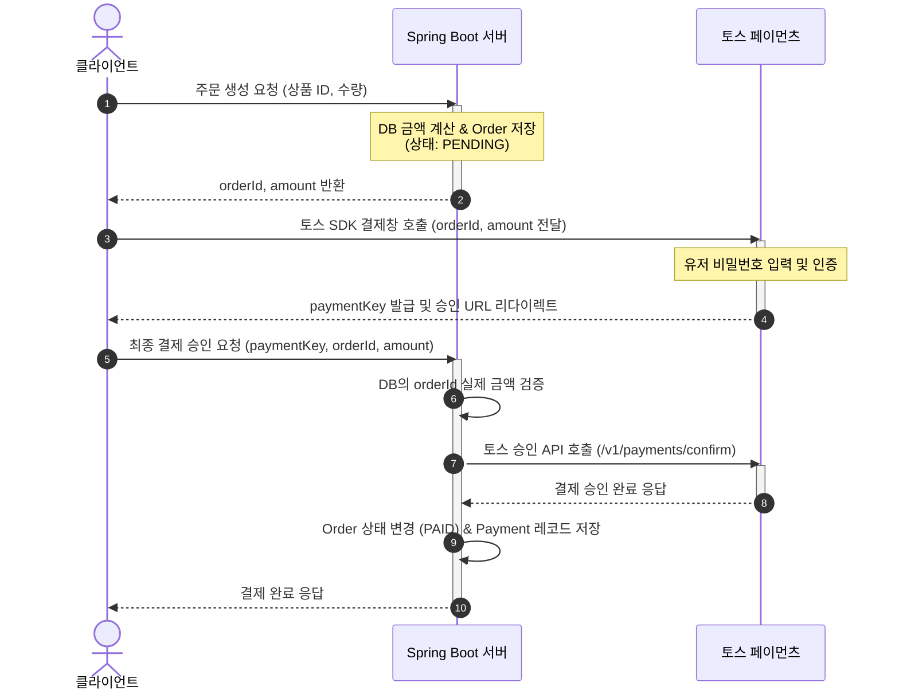

# 20260729 ~ 20260804
전체적인 흐름을 잡았다.

기본적으로 backend 구현은 spring boot를 통해 직접구현을, frontend구현은 추후에 claude와 같은 ai agent를 통해 구현을 할 계획이다.

따라서 6개월의 기간을 목표로 잡고, backend -> frontend -> test -> 배포의 과정을 거칠 계획이다.

#### 금주 할일
- [x] harness rule setting : copilot-cli는 github student pack을 가입한 github pro 사용자들에게 무료로 제공되는 토큰이 존재한다. 이는 적은 양이지만 성능이 꽤 좋은 편이라고 생각해서 전반적으로 주간 스케줄을 작성하고, 구현에 이상이 존재하는지 등을 부트캠프의 강사 입장에서 확인할 수 있도록 설정하였다.
- [x] Data structure : 쇼핑몰에서 기본이 되는 user, cart, product, order의 데이터 스키마를 설계하고, 이를 entity class로 표현하는 것을 목표로 둔다.
- [x] DTO structure : 위 데이터 스키마 설계에서는 중요한 user, cart, product, order 데이터의 뼈대를 설계하였는데, 추가적으로 api를 통해 json파일을 받을 때, 응답을 할 때 등의 과정에서 필요한 dto를 설계하였다.
- [x] global config : Global Exception Handler와 ErrorCode를 통해 발생가능한 예외상황을 정의하고, HttpStatus를 상황별로 고정시켜 반환할 수 있도록 구현
- [x] API Response : API 요청이 들어온 경우, 정해진 양시에 따라 응답을 할 수 있도록 ApiResponse 클래스 작성
- [x] Constant : 테이블 이름과 같은 상수를 따로 저장하고, 추후 필요에 따라 컬럼의 이름을 기존 엔티티 필드와 다르게 설정할 경우 매핑될 수 있도록 작성할 것인지 판단, api url을 상수로 뺄 것인지도 판단.
- [x] 추가) CheckConfig : 앞선 엔티티 구현에서 NPE체크, 문자열의 경우 Blank 확인, 수량과 같은 정수는 음수 확인 등 값들의 확인이 중복되는 것을 확인하고, 이를 CheckConfig에 메서드로 정의하여, 통합된 방식으로 확인

#### 트러블
1. NPE : null pointer exception이라는 뜻으로, db에 table을 생성할때, column을 정하게 되는데, 이때 column 어노테이션과 nullable의 조합으로 해당 컬럼에 null을 허용할 것인지 쿼리를 자동 설정할 수 있다. 그 외에도 dto -> entity로 데이터 변환 작업이 이뤄질 경우, null에 대한 참조가 발생할 때, null pointer 참조에 대한 예외처리를 확실하게 하여 서버가 다운되는 일을 방지한다. (때때로 dto에 null을 의도적으로 허용하여 dto가 원하는 데이터를 담을 수 있도록 설정한 경우도 존재하기에 꼼꼼하게 살핌)
2. Harness file : 하네스 파일은 ai agent가 작업을 실행할 때, 어떤 작업을 어떤 위치에서 실행하는지 등을 정확하고 상세하게 명시해주는 것이 좋다. 이때 너뭄 세세하게 명시하다 보면 충돌이 일어나는 개념이 존재할 수 있는데, 내가 작성한 하네스 파일을 예시삼으면, 저번주 목표 기술적 문제 확인 -> 기능적 문제 확인 -> 전체적인 흐름에 따른 다음 한주 동안 목표 설정의 과정을 obsidian vault내부 copilot-addendum.md파일에 서술하라고 명시하였는데, 이때 날짜를 위에서는 하루단위로 설정하고, 밑에서는 1주일의 단위로 설정하니 혼돈이 생겨서 어쩔때는 하루 단위, 어쩔때는 일주일의 단위로 설정되는 것을 확인 할 수 있었다. 따라서 본인의 의도대로 ai agent를 작동시키기 위해서는 전체적으로 서술을 한 후, 자신의 의도가 다 담겨있는지 확인한 후, 충돌되는 부분이 존재하는지 확인한 후, 시험삼아 몇 번 돌려보는 것이 좋은 것 같다.
3. Data type : 기존 정수의 타입을 Integer로 통일을 했었는데, 이를 Long으로 바꾸게 되었다.
	1. 데이터의 범위가 Integer은 약 21억까지 지원을 하기에 충분할 것으로 생각을 하였는데, 주문정보나 장바구니에 담는 물건 정보등은 Integer로 설계될 경우 빠르게 찰 것으로 생각되어 Long으로 바꾸게 되었다.
	2. JPA 및 Spring Data JPA의 기본 예제와 표준 엔티티 인터페이스에 따르면 Long타입으로 작성이 되었다.
	3. 외부 PG사와의 결제 기능을 추후에 넣을 예정인데, 이때 Long/BigInt를 기준으로 삼는 시스템이 많다.
	4. MySQL의 BIGINT타입과 Long타입이 1:1로 대응된다.
4. 데이터 체크 : 데이터를 체크할 때, string의 경우 npe + isblank의 조합으로 유효성 검증, 수량과 같은 정수는 npe + negative 조건문으로 확인 등 데이터 유효성 검증에 코드가 겹치는 경우가 발생하였고, 이를 Exception Handler처럼 따로 데이터 검증 클래스에 메서드로 구현하여 보일러 플레이트 코드를 최소화함.
5. 단방향 / 양방향 매핑 엔티티 : JPA(Hibernate)를 통해 User는 user_id에 1:1매핑되는 카트를 객체로 갖게 하거나, cart는 cartitem을 1:N관계로 양방향 매핑하는 등의 관계를 구현하는 과정에서 필요한 어노테이션(Joincolumn, onetomany, onetoone 등)을 이해하고, orphanremoval과 같은 고아 객체 삭제, cascade 설정을 통한 영속성 전이(cartitem의 수정시 cartitemlist에 영향을 미치도록 설정), fetchtype.lazy를 통한 지연설정 등을 설정하고, 해당 설정 과정에서 totalprice와 같이 product의 업데이트에 따라 cartitem의 curproductitem 필드에 영향을 미쳐 totalprice가 변하는 방식등을 어느 부분에서 이뤄지도록 할 것인지 설정하였다.

# 20260805 ~ 20260811

이번주의 전반적인 목표는 기본적인 Controller + Service를 통해 기본적인 CRUD를 추가하고, 이 과정에서 API URL을 Swagger-ui의존성을 추가하여 설정하는 것이 목표

#### 금주 할일
- [/] Controller & service 구현 : 야그니 원칙에 따라 시나리오를 구상하고, 이에 필요한 4개의 엔티티에 대한 CRUD 기능과 Http method 구현
-> user, product에 대한 구현은 마무리 하였지만, cart/product는 미흡
- [x] Api 명세서 & url 설정 : swagger-ui 의존성 추가와 swagger-ui를 통한 api명세서 확인

#### 트러블
1. 데이터 유효성 : 전 주에 데이터 유효성을 한 클래스에 메서드로 구현하여 보일러 플레이트 코드를 줄이려고 노력했는데, 이전에 구현된 Entity & dto에 적용안된 코드들이 다수 존재했고, 이를 수정함. 따라서 앞으로는 중간에 특정 기능을 대체하는 코드를 구현하게 될 경우, 이전 코드들을 즉각적으로 리펙토링하는 습관이 필요
2. cart 정보 조회 문제 : cart정보를 조회하여 장바구니 확인 -> 주문 생성 + 결제의 흐름으로 시나리오를 설계하였지만, 이 과정에서 문제가 발생함. cart정보를 조회하는 과정에서 cartItem의 curProductPrice와 같은 값들을 productId와 매핑하여 갱신하도록 할 계획이였지만, 이는 큰 딜레이를 가져오게됨. 따라서 redis와 같은 인메모리에 curProductPrice를 직접적으로 저장하는 방식이 아닌, product정보를 올리고, 이를 productId로 조회만 할 수 있도록 하여 CUD의 작업을 최소화하는 방식으로 구현할 수 있도록 목표를 새로 잡았고, redis를 사용해본 경험이 전무하기 때문에, 이를 이해하고, 구현할 수 있도록 다음 주에 진행할 예정(설계의 중요성을 다시 한번 파악함)
3. 결제 방식 : kakaopay, tosspay 등의 PG사의 api를 통한 결제를 진행하도록 목표를 잡았는데, 요청과 받는 응답을 처리하는 기능 등을 구현하는게 너무 복잡함. 따라서 다음 주에는 tosspay를 기준으로 결제를 진행하도록 목표를 잡음.
4. api url 설계 : url은 접근할 자원의 경로를 적어주는 것이기에 create나 get 등의 기능적인 단어를 넣지 않음.
-> 다음주 개발 목표에 redis + tosspay를 추가하고, 기본적인 쇼핑몰의 틀이 잡히게 되면, next.js를 통한 webserver 구현 + ui기본적인 틀을 짜는 방향으로 진행. 이후에는 CI/CD와 docker + kubernetes를 추가하여 백엔드의 추가되는 기능과 이에 대한 ui를 github action으로 배포하는 것을 연습할 계획

# 20260812 ~ 20260818

이번주는 저번주 트러블 슈팅에서 알 수 있듯이 redis 적용 + cartItem 수정, tosspay 결제 방식 추가가 주된 내용이다. 추가적으로 Session방식과 JWT방식을 고민했었는데, 무상태성을 통해 DB의 부담을 줄일 수 있는 JWT를 선택하였다. (물론 추후에 블랙리스트 기능을 추가하게 되면 이는 무상태성에서 벗어난다고 생각은 하지만, 현재 상태성을 구현하는 방식은 JWT로 해결할 수 있을 것 같아 JWT를 선택하게 됨.)

#### 금주 할일
- [ ] redis 공부 + 적용하여 cart controller & service 구현 완료하기
- [ ] tosspay 결제 방식 도입하여 order controller & service 구현 끝내기
- [ ] 모든 controller의 http method 요청 방식을 JWT로 통일시키기

#### 트러블
1. 