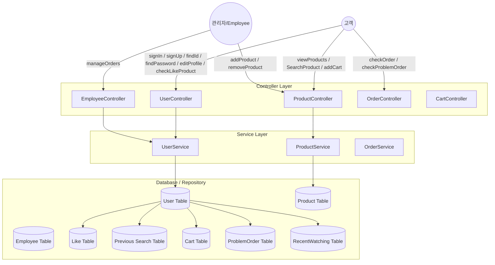

```mermaid
---
config:
layout: dagre
---
flowchart TB
	subgraph Controller_Layer["Controller Layer"]
	UC["UserController"]
	EC["EmployeeController"]
	PC["ProductController"]
	OC["OrderController"]
	CC["CartController"] 
end
  
subgraph Service_Layer["Service Layer"]
	US["UserService"]
	PS["ProductService"]
	OS["OrderService"]
end

subgraph DB["Database / Repository"]
	UserTable[("User Table")]
	ProdTable[("Product Table")]
	EmpTable[("Employee Table")]
	LikeTable[("Like Table")]
	PreviousSearchtable[("Previous Search Table")]
	CartTable[("Cart Table")]
	ProblemOrderTable[("ProblemOrder Table")]
	RecentWatchingTable[("RecentWatching Table")]
end

User(("고객")) -- signIn / signUp / findId / findPassword / editProfile / checkLikeProduct --> UC
User -- viewProducts / SearchProduct / addCart --> PC
User -- checkOrder / checkProblemOrder --> OC
Admin(("관리자/Employee")) -- manageOrders --> EC
Admin -- addProduct / removeProduct --> PC

UC --> US
EC --> US
PC --> PS
US --> UserTable
PS --> ProdTable

UserTable --> LikeTable & PreviousSearchtable & CartTable & ProblemOrderTable & RecentWatchingTable
```
