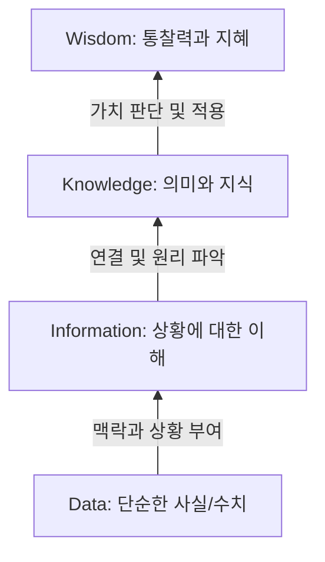

# DB System

- DB 유형을 알아보고, 개념 및 특징 이해
- 정보 System 발전 과정을 통한 DB System 등장 배경
- FS vs DB System -> DB System 장점
- DB System 구성요소

## DB, DB System

- 데이터 : 관찰의 결과로 나타난 정량적 혹은 정상적인 실제 값
- 정보 : 데이터에 의미를 부여한 것
- 지식 : 사물이나 현상에 대한 이해

#### DIKW 계층구조

#### 데이터베이스 활용
- 데이터베이스 시스템은 데이터의 검색과 변경 작업을 주로 수행
- 변경이란 시간에 따라 변하는 데이터 값을 데이터베이스에 반영하기 위해 수행하는 작업

#### 데이터베이스 개념 및 특징
- 데이터베이스 : 여러 사람이 공용으로 사용하기 위해 통합하고 저장한 운영 데이터의 집합
- DB
	1. 통합된 데이터 : 데이터를 통합하여 하나로 저장된 데이터, 중복을 최소화하여 데이터 불일치 현상 제거
	2. 저장된 데이터 : 문서가 아닌 컴퓨터 저장 장치에 저장된 데이터를 의미
	3. 운영 데이터 : 조직의 목적을 위해 사용되는 데이터
	4. 공용 데이터 : 공동으로 사용되는 데이터
- 특징
	1. 실시간 접근
	2. 계속 변화
	3. 동시 공유
	4. 내용 참조 : 물리적인 위치가 아닌 데이터 값을 통해 데이터 검색

#### 데이터베이스 시스템의 구성
- DB System : 각 조직에서 사용하던 데이터를 통합하고, 공유할 때 생기는 장점을 이용하는 시스템
- DBMS
- DB
- Data Model : 데이터가 저장되는 기법에 대한 내용

## 데이터베이스 시스템 발전
- 저장할 정보 증가 + 컴퓨터 기술의 발전으로 더 많은 양의 데이터 저장 가능 + 고객에게 더 많고, 다양한 기능 제공 -> DB 탄생

#### 정보 시스템의 발전
1. 파일 시스템 : 각 응용프로그램이 독립적으로 파일을 다루기에 데이터 중복 저장 가능성 존재 및 데이터 일관성 훼손
2. 데이터베이스 시스템 : 일관성 유지, 복구, 동시접근 제어 등의 기능 수행, 데이터 중복을 줄이고 데이터 표준화하여 무결성 유지
3. 웹 데이터베이스 시스템 : 
	1. 웹 브라우저 프로그램을 통해 웹 서버에 접속
	2. 데이터 요청
	3. DBMS 서버에 요청을 전달
	4. 데이터 제공
	5. 사용자에게 전달
4. 분산 데이터베이스 시스템 : 데이터가 여러곳에서 발생 시 각각 DB운영, 이들 간에 상호 연동

## 파일시스템, DBMS
1. 데이터를 프로그램 내부에 저장 시 : 새로운 데이터가 발생할 때마다 컴파일을 다시 하고, 프로그램을 그동안 중단
2.          "    파일시스템에 저장 시 : 새로운 데이터가 추가되어도 프로그램 수정 x, 위 문제는 해결되지만, 데이터의 구조가 바뀌거나 둘 이상의 프로그램에서의 동시접근이 제한됨
3.          "    DBMS를 통해 저장 시 : 데이터 변경, 조회를 DBMS를 통해 작동

#### DBMS의 장정
1. 데이터 중복 최소화
2. 데이터 일관성 유지
3. 데이터 독립성 유지
4. 관리 기능 제공
5. 프로그램 개발 생산성 향상
6. 데이터 무결성 유지

## 데이터베이스 시스템 구성
#### 데이터베이스 언어
- SQL 
	- 데이터 정의어 : DBMS에 저장된 테이블 구조를 정의
	- 데이터 조작어 : 데이터 조회 및 변경
	- 데이터 제어어 : 데이터 사용 권한 관리

#### 데이터베이스 사용자
- 일반 사용자 : 프로그래머가 개발한 프로그램을 이용해 DB접근
- 응용 프로그래머 : 일반 사용자가 사용할 수 있도록 프로그램 개발
- SQL 사용자 : 응용프로그램으로 구현되지 않은  업무를 SQL을 사용해 업무 처리 
- 데이터베이스 관리자 : DB system 총괄자

#### DBMS
- 데이터 정의
- 데이터 조작
- 데이터 추출
- 데이터 제어 : 동시성 제어 및 백업

#### 데이터 모델
- 데이터베이스 시스템에서 데이터를 저장하는 이론적인 방법
- 어떻게 구조화되어 저장하는지 결정
- 데이터 간 관계를 표현하는 방법

# 관계 데이터 모델
- 관계 데이터 모델의 개념 이해
- 관계 데이터 모델의 제약 조건
- 관계 데이터 모델의 연산인 관계 대수의 종류 / 작성법

## 관계 데이터 모델의 개념

#### 관계
- 관계
	- 릴레이션(테이블)내의 관계 : 릴레이션 내 데이터들의 집합으로 표현
	- 릴레이션 간의 관계 : 릴레이션을 식별 가능한 값을 이용해 표현
- 스키마 : 관계 데이터베이스의 릴레이션의 구성, 어떤 정보를 담고 있는지에 대한 기본적인 구조 정의
 - 속성 : 릴레이션 스키마의 열
 - 도메인 : 속성이 가질 수 있는 값의 집합
 - 차수 : 속성의 개수

- 특징
	1. 속성은 단일 값을 갖는다
	2. 속성은 서로 다른 이름을 갖는다
	3. 한 속성의 값은 모두 같은 도메인 값을 가진다
	4. 속성의 순서는 상관없다
	5. 릴레이션 내의 중복된 튜플은 허용되지 않는다
	6. 튜플의 순서는 상관없다.

