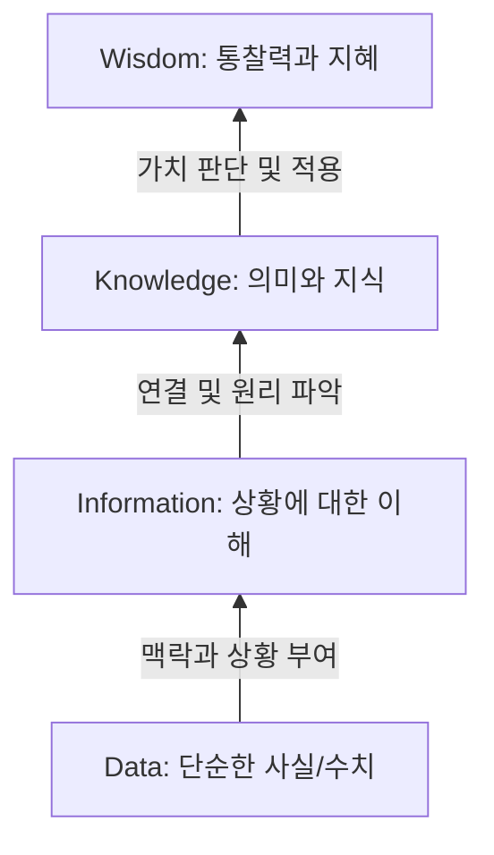

# DB System

## DB, DB System

- 데이터 : 관찰의 결과로 나타난 정량적 혹은 정상적인 실제 값
- 정보 : 데이터에 의미를 부여한 것
- 지식 : 사물이나 현상에 대한 이해

#### DIKW 계층구조

#### 데이터베이스 활용
- 데이터베이스 시스템은 데이터의 검색과 변경 작업을 주로 수행
- 변경이란 시간에 따라 변하는 데이터 값을 데이터베이스에 반영하기 위해 수행하는 작업

#### 데이터베이스 개념 및 특징
- 데이터베이스 : 여러 사람이 공용으로 사용하기 위해 통합하고 저장한 운영 데이터의 집합
- DB
	1. 통합된 데이터 : 데이터를 통합하여 하나로 저장된 데이터, 중복을 최소화하여 데이터 불일치 현상 제거
	2. 저장된 데이터 : 문서가 아닌 컴퓨터 저장 장치에 저장된 데이터를 의미
	3. 운영 데이터 : 조직의 목적을 위해 사용되는 데이터
	4. 공용 데이터 : 공동으로 사용되는 데이터
- 특징
	1. 실시간 접근
	2. 계속 변화
	3. 동시 공유
	4. 내용 참조 : 물리적인 위치가 아닌 데이터 값을 통해 데이터 검색

#### 데이터베이스 시스템의 구성
- DB System : 각 조직에서 사용하던 데이터를 통합하고, 공유할 때 생기는 장점을 이용하는 시스템
- DBMS
- DB
- Data Model : 데이터가 저장되는 기법에 대한 내용

## 데이터베이스 시스템 발전
- 저장할 정보 증가 + 컴퓨터 기술의 발전으로 더 많은 양의 데이터 저장 가능 + 고객에게 더 많고, 다양한 기능 제공 -> DB 탄생

#### 정보 시스템의 발전
1. 파일 시스템 : 각 응용프로그램이 독립적으로 파일을 다루기에 데이터 중복 저장 가능성 존재 및 데이터 일관성 훼손
2. 데이터베이스 시스템 : 일관성 유지, 복구, 동시접근 제어 등의 기능 수행, 데이터 중복을 줄이고 데이터 표준화하여 무결성 유지
3. 웹 데이터베이스 시스템 : 
	1. 웹 브라우저 프로그램을 통해 웹 서버에 접속
	2. 데이터 요청
	3. DBMS 서버에 요청을 전달
	4. 데이터 제공
	5. 사용자에게 전달
4. 분산 데이터베이스 시스템 : 데이터가 여러곳에서 발생 시 각각 DB운영, 이들 간에 상호 연동

## 파일시스템, DBMS