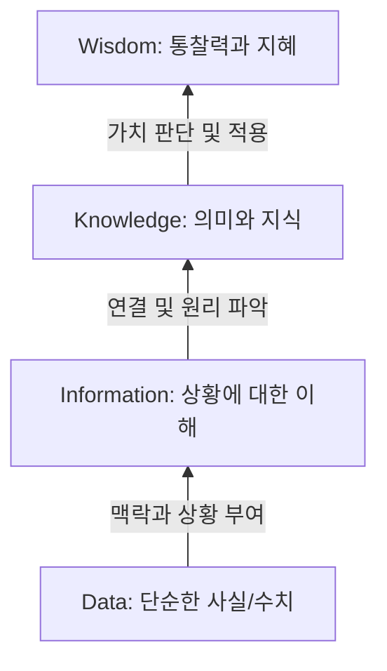

# DB System

## DB, DB System

- 데이터 : 관찰의 결과로 나타난 정량적 혹은 정상적인 실제 값
- 정보 : 데이터에 의미를 부여한 것
- 지식 : 사물이나 현상에 대한 이해

#### DIKW 계층구조

#### 데이터베이스 활용
- 데이터베이스 시스템은 데이터의 검색과 변경 작업을 주로 수행
- 변경이란 시간에 따라 변하는 데이터 값을 데이터베이스에 반영하기 위해 수행하는 작업

#### 데이터베이스 개념 및 특징
- 데이터베이스 : 여러 사람이 공용으로 사용하기 위해 통합하고 저장한 운영 데이터의 집합