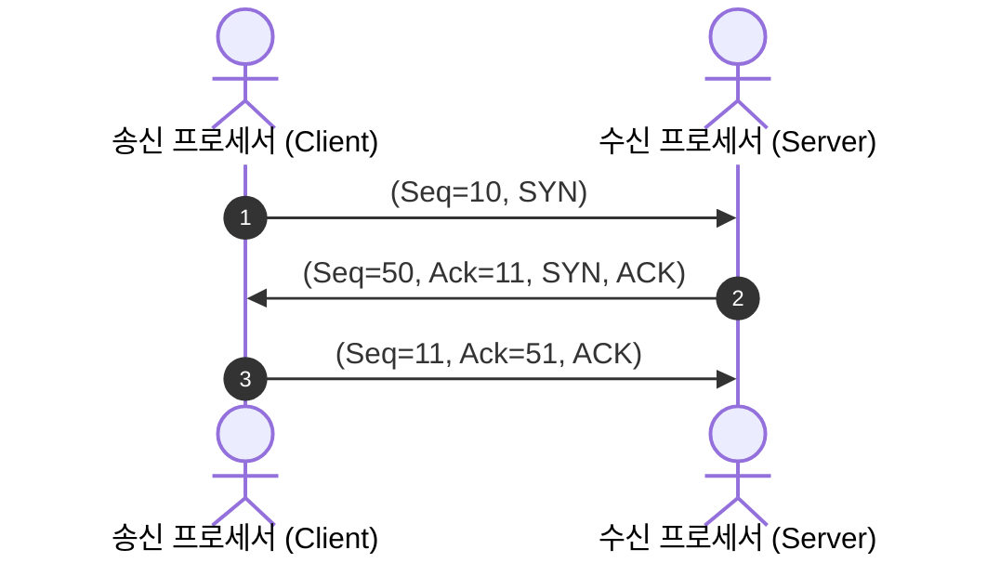
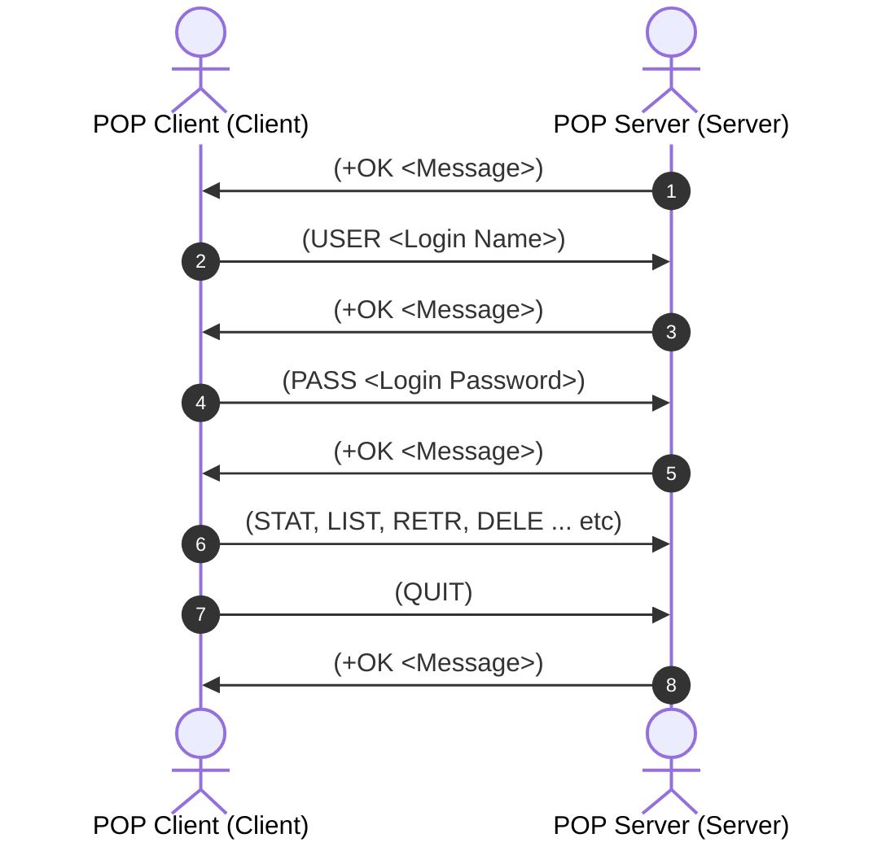

---
tags:
  - seed
aliases: []
created: 2026-04-17
---
# 네트워크의 기초

## 구조적 모델
#### OSI 7계층

#### 인터네트워킹

#### 프로토콜

## 주소의 표현

#### 구분자가 갖는 특징 4가지

#### IP 주소

#### 호스트 이름

#### DNS

#### 호스트 파일

# 네트워크 개념

- Protocol ?

## 계층적 모델 구조 

#### 모듈화

#### 계층구조

## 프로토콜 설계시 주의사항

#### 주소 표현

#### 오류 제어

#### 흐름 제어

## 서비스 프리미티브

#### 서비스

## OSI 7 계층

#### 헤더

#### 중개 기능

# 네트워크 기술

## 라우팅 기능

#### 라우팅 시스템
- 회선 교환
- 메세지 교환
- 패킷 교환

#### 패킷 교환
- 가상회선
- 데이터그램

#### 프레임 릴레이 / 셀 릴레이

## 네트워크의 분류

#### LAN
- 버스형
- 링형
- 라우팅 필요 x -> 물리계층으로만 연결되어 있기 때문
#### MAN
- FIFO, Queue, 단방향 선로를 두 개 놓아 전이중처럼 동작

#### WAN
- 라우팅 반드시 필요

## 인터네트워킹

#### 브리지
- 트랜스페런트 브리지
	- 라우팅 테이블
	- 스패닝 트리 : 순환을 막기 위해 일부 간선을 지워 순환 억제 -> 스패닝 트리 알고리즘
- 소스 라우팅 브리지 : 간편하지만 효율적이지 않는 위 브리지 송신 바익에서 수신의 경로를 모두 기술하여 해당 경로 정보ㅡㄹ 프레임 헤더에 포함하여 전달

#### IP 인터네트워킹

#### 인터넷 라우팅
- 고정 경로 배정 
- 적응 경로 배정
- 자율 시스템

# 데이터 전송

## 전송 방식

#### 네트워크의 기능 3가지
- 정보 공유
- 병렬처리에 의한 성능 향상
- 중복 저장을 통한 신뢰성 향상

#### 전송과 라우팅
- 전달
- 전송
- 라우팅

#### 점대점 방식
- 스타형
- 링형 
- 완전형
- 불규칙형

#### 브로드캐스팅
- 링형
- 버스형

#### 멀티포인트 방식
- 유니캐스팅 : 두 호스트 사이의 데이터 전송을 의미
- 멀티포인트 : 1:N, N:N 사이의 데이터 전송을 의미
- 멀티포인트 유니캐스팅
- 브로드캐스팅
- 멀티캐스팅

## 오류 제어

#### 전송오류 유형
- 프레임 변형 오류
- 프레임 분실 오류
- 정상적인 전송

#### 오류 복구 기능
- 수신 호스트의 응답 프레임
- 송신 호스트의 타이머 기능
- 순서 번호 기능
- 오류검출코드

#### 다항 코드(CRC)

#### CheckSum

# MAC 계층

## MAC/LLC

#### MAC
- CSMA/CD
- Token Ring
- Token Bus

#### LLC

## CSMA/CD
- 공유 버스 내 데이터 충돌을 허용하고, 충돌 시 이를 해결하는 방식을 지원
- 버스 내 다른 호스트가 공유버스를 사용하는지 확인 후 전송
#### 신호 감지
- 1-persistent-CSMA
- Non-persistent-CSMA
- p-persistent-CSMA

#### 충돌 감지
- 트랜시버

#### 프레임 구조
- MAC header + data frame(상위 계층의 header + data frame) + trailer
- header
	- preamble : 송신 호스트의 클록과 동기를 맞출 수 있도록 시간 여유 제공
	- start delimeter : 프레임 시작 표시
	- source / destination ADDR
	- Length / type
- trailer : checksum

#### hub / switch
- 트랜시버 대체
- hub : 각 호스트가 허브에 스타형으로 연결
- switch : 위 허브에 스위치 추가 -> 정해진 수신 호스트에게만 데이터 전송
## Token Bus

## Token Ring

# 데이터 링크 계층

## 프로토콜의 기초
#### 주소의 필요성

#### 프레임의 종류
- 정보 프레임 : I frame
- 긍정응답프레임 : ACK
- 부정응답프레임 : NAK

#### 오류/흐름 제어가 필요 없는 프로토콜
- 단방향 통신
- 전송오류가 없는 물리매체
- 무한 개의 수신 버퍼

#### 오류 제어가 필요 없는 프로토콜
- 단방향 토인
- 전송오류가 없는 물리매체
- 정지-대기 프로토콜

#### 단방향 프로토콜(응답 프레임은 데이터로 보지 않음)
- Time-out
- NAK가 없는 경우
- NAK가 있는 경우

## 슬라이딩 윈도우 프로토콜
- 두 호스트 간 프레임 양방향 전송을 위한 통신 프로토콜

#### 흐름제어 
- 슬라이딩 윈도우
- 순서번호
- 윈도우 크기

#### 연속형 전송
- 고백 N 방식
- 선택적 재전송 방식

#### 피기배킹

## HDLC 프로토콜

---
기말

# IP 프로토콜

## 네트워크 계층의 기능
- 라우팅 : 송수신 호스트 사이의 패킷 전달 경로 선택하는 과정
- 혼잡 제어 : 네트워크에 패킷 수가 과도하게 증가하는 현상을 혼잡이라고 하고, 혼잡 현상을 예방하거나 제거하는 기능
- 패킷의 분할과 병합 : 큰 데이터를 여러 패킷으로 나누는 분할작업과 목적지인 수신 호스트에서 분할된 패킷을 다시 모으는 병합과정

### 연결형 / 비연결형 서비스
- 연결형 서비스 : 패킷을 전송하기 전에 송수신 호스트 사이에 연결을 설정하는 연결형 서비스, 신뢰성이 높고, 패킷을 전송 전 연결을 미리 설정하여 송신하는 방식, 모두 동일한 경로를 이용하기 때문에 목적지에 도착하는 패킷의 순서가 송신된 순서와 동일(TCP)
- 비연결형 서비스 : 연결 설정 없이 데이터를 패킷 단위로 전송하는 비연결형 서비스, 신뢰성이 다소 떨어지며, 패킷이 서로 다른 경로로 전송되기에 패킷의 도착순서가 일정하지 않을 수 있다.(IP, UDP)

### 라우팅
- 패킷의 전송 경로 지정 -> 입력된 패킷을 어느 경로를 통해 다음 라우터에 보내야 가장 효과적인지 결정
- 가상회선 : 모든 패킷을 동일 경로를 거쳐 전송, 패킷의 전달 순서도 일관됨
- 데이터그램 : 모든 패킷을 고정 경로 없이 독립적인 경로로 전달, 패킷의 전달 순서가 일관되지 않음

#### 정적 / 동적 라우팅 -> 라우팅 테이블을 구성하는 방식
- 의도적 / 비의도적으로 발생하는 네트워크 구성의 변화에 효과적으로 대체 가능한 신뢰성 확보도 라우팅 경로 선택 시 중요하게 고려될 사항
- 정적 라우팅 : 패킷 전송이 발생하기 전 경로 정보를 라우터에 미리 저장하여 중개하는 방식, 네트워크 구성에 변화가 생기면 이에 적절하게 대처 불가
- 동적 라우팅 : 경로 정보를 네트워크 상황에 따라 적절하게 변경하는 방식, 경로 정보 수집 및 관리 등의 복잡한 작업이 추가로 필요

#### Hello / Echo 패킷
- 이웃 라우터의 경로 정보 파악
- Hello 패킷 : 이웃에 연결된 라우터의 경로 정보를 얻기 위한 패킷
- Echo 패킷 : 인근 라우터와의 전송지연시간 확인하는 패킷, 인근 라우터가 살아있는지 확인하는 패킷

#### 라우팅 테이블
- 패킷 전송 과정에서 라우터들이 적절한 경로를 쉽게 찾을 수 있도록 사전에 인근 라우터의 경로 정보를 적은 테이블
- 라우팅 테이블 : <목적지, 다음 홉(목적지 호스트까지 패킷을 효과적으로 전달하기 위한 다음 라우터)>

#### 라우팅 정보의 처리 -> 라우팅을 처리하는 방식
- 라우팅을 효과적으로 수행하기 위해 현재 네트워크의 상황을 정확히 반영 요구(동적 라우팅)
- 소스 라우팅 : 패킷을 전송하는 호스트가 목적지 호스트까지 전달 경로를 스스로 결정하는 방식
- 분산 라우팅 : 라우팅 정보가 분산되는 방식으로 패킷의 전송 경로에 위치한 각 라우터가 효율적인 경로 선택에 참여한다. -> 데이터그램, RCC와 같은 라우팅 테이블을 동적으로 계산해주는 기능이 존재하지 않으므로, 각 라우터들이 효율적인 경로를 동적으로 계산하여 경로 선택
- 중앙 라우팅 : RCC라는 특별 호스트를 통해 전송 경로에 관한 모든 정보를 관리하여 소스 라우팅 방식으로 경로 선택 -> 이때 RCC는 라우터의 라우팅 테이블을 현재 네트워크 상황에 맞춰 동적으로 수정
- 계층 라우팅 : 분산 라우팅 + 중앙 라우팅을 적절히 조합하여 계층구조로 네트워크 구성
-> 분산 라우팅의 경우 전세계 모든 네트워크 내 목적지 호스트의 주소를 라우팅 테이블에 저장해야 되지만, 계층 라우팅은 각 네트워크의 경계 라우터만 알고 있으면 되서 목적지 호스트가 속한 네트워크의 경계 라우터에 패킷을 송신 호스트가 속한 네트워크 내 경계 라우터를 통해 전송하면 목적지 호스트에 존재하는 경계 라우터가 스스로 분산라우팅으로 목적지에 도달

## 혼잡 제어

#### 혼잡 원인
- 네트워크의 용량(처리 능력)보다 더 많은 전송 패킷 때문
- 타임아웃 기능을 통해 패킷 재전송이 발생할 경우 송신 패킷의 양이 증가
- 응답 알고리즘도 혼잡에 영향을 미침 -> 피기배킹으로 처리 시도 -> 혼잡시 피기배킹을 통해 재전송이 발생할 경우 오히려 혼잡 가중
- 라우팅 알고리즘
-> 생존시간을 패킷에 설정하여 생존시간이 지난 패킷은 엉뚱한 경로를 떠도는 것으로 판단하여 네트워크에서 제거
- 생존시간을 너무 크게 설정할 경우 : 네트워크에 불필요한 부하를 줌
- 생존시간을 너무 작게 설정할 경우 : 호스트에 도달 전에 패킷이 네트워크에 삭제되어 재전송 우려

#### 트래픽 성형
- 혼잡은 트래픽이 특정시간에 몰리는 버스트 현상에서 기인됨 -> 송신호스트가 전송하는 패킷의 발생빈도가 네트워크가 예측 가능한 전송률로 이뤄지게 하는 기능 필요 -> 트래픽 성형
- 전체 트래픽의 혼잡도를 예측하여 혼잡 제어를 효율적으로 수행
- 리키 버킷 : 송신 호스트로부터 입력되는 패킷이 시간대별로 가변적이어도 깔때기를 통과하면서 일정한 전송률로 변경

#### 혼잡 제거
- 혼잡이 사라질 때까지 연결 설정을 허락하지 않음 -> 전체 지역보다는 특정 지역에 혼잡이 발생하는 경우가 많음 -> 전체를 막는 것은 비효율적 -> 특정 지역에 혼잡이 발생하면 전송 경로를 적절히 조정하여 혼잡이 발생하지 않은 곳으로 가상 회선 연결 설정
- 호스트와 서브넷이 가상 회선 연결 과정에서 협상 : 전송과정에서 사용하는 대역을 미리 할당 받아 네트워크에 수용 불가능할 정도로 트래픽이 발생하는 일을 예방
- ECN 패킷 : 송신 호스트 -> 수신 호스트로 패킷을 보내는 경로에 위치한 라우터가 혼잡 우려 지역 내부에 존재할 경우, 패킷에 ECN 패킷을 추가하여 혼잡 우려 지역임을 알림 -> 이때 처음으로 ECN 패킷을 추가한 라우터 이후에 존재하는 라우터가 중복으로 주의 표시(ECN 패킷) -> 수신호스트가 패킷을 받고 혼잡 우려 지역을 확인 -> ECN-Echo를 통해 송신자에게 속도를 줄이라는 메시지를 담아 응답

## 라우팅 프로토콜

### 간단한 라우팅

#### 최단 경로 라우팅 
- 목적지에 도달할 때까지 거치는 라우터 수가 최소화가 될 수 있는 경로 설정 -> 여러 경로 중 가장 짧은 경로 선택

#### 플러딩 
- 라우터가 자신에게 입력된 패킷을 출력 가능한 모든 경로로 중개하는 방식 -> 중요한 데이터를 모두에게 알리는 환경에서 제한적 사용

### 거리 벡터 라우팅 프로토콜
- 라우터가 자신과 연결된 이웃 라우터와 라우팅 정보를 교환하는 과정
- 거리 벡터 알고리즘 구현을 위해 라우터가 필수적으로 관리해야하는 정보
	- 링크 벡터 : 이웃 네트워크에 대한 연결 정보
	- 거리 벡터 : 개별 네트워크까지의 거리 정보
	- 다음 홉 벡터 : 개별 네트워크로 가기 위한 다음 홉 정보

# 네트워크 계층

## IPv6 프로토콜
- 주소공간 확장 : 기존 IPv4(32 bit)에서 IPv6(128 bit)로 확장
- 헤더 구조 단순화 : 불필요한 필드가 제외되거나 확장 헤더 형식으로 변경
- 흐름 제어 기능 지원 : 연관 패킷을 하나의 연속 스트림으로 전달하여 실시간 기능이 필요한 멀티미디어 응용 환경을 수용할 수 있다.

### IPv6 헤더 구조
- Hop-by-Hop Options Header : Jumbo 페이로드 옵션과 라우터 긴급 옵션 등과 같은 hop-by-hop 옵션을 지원한다.
- Routing Header : IPv4의 소스 라우팅과 유사한 기능을 제공하는데, 패킷이 Routing Header에 지정된 특정 노드를 경유하게 한다. 
- Fragment Header : 패킷 분할과 관련된 정보를 포함한다.
- Destination Options Header : 수신 호스트가 확인 가능한 옵션 정보
- Authentication Header : 패킷 인증과 관련된 기능을 제공
- Encapsulating Security Payload Header : 프라이버시 기능을 제공하기 위해 페이로드 암호화, 목적지 호스트에서 암호화를 해독할 수 있는 정보도 같이 제공
#### DS/ECN 필드
차등 서비스가 도입되면서 6비트의 DS 필드와 2비트의 ECN 필드가 정의되었다.
- Flow Label 필드 : 음성이나 영상같은 스트리밍 서비스를 제공하기 위해 존재하는 필드이다, 라우터가 중개할 때 동일한 기준을 적용해 처리할 수 있게 한다, IPv6는 특정 송수신 호스트 사이에 전송되는 데이터를 하나의 흐름으로 정의해, 중간 라우터가 특별한 기준으로 처리할 수 있게 한다.
* 이때, Flow Label을 지원하지 않는 호스트나 라우터에서는 IPv6 패킷을 생성할 때 반드시 0으로 지정한다.
* Flow Label 필드의 값이 0 이외의 동일한 번호로 부여받은 패킷은 DA, SA, Priorty, HopbyHopOption..

#### 기타 필드
- Version Number: IP 프로토콜의 버전 정보
- PayLoad Length / Next Header: 기본 헤더 다음에 이어지는 헤더의 유형을 수신 호스트에 알려준다.
- Next Header에 표시할 수 있는 헤더는 IPv6의 확장 헤더이거나, 상위 계층인 TCP, UDP의 헤더일 수 있다.
- Hop Limit: IPv4의 Time To Live를 의미
- SA/DA : 송수신 호스트 IP 주소

### IPv6 주소

#### 주소 표현
- 기존은 X:X:X:X:X:X:X:X(X 8개, 16bit표현)로 표현
- X:X:X:X:X:X:d,d,d,d (d는 기존 IPv4 주소를 표현) : X는 16비트, d는 8비트

#### 주소 공간 
- 주소대별 용도가 다름

## 이동 IP 프로토콜
- 호스트의 위치에 따라 IP주소의 변경 -> 주소읠 변경 여부에 따라 경로 선택에 영향을 미침
- 지속적으로 바뀌는 IP주소에 따라 라우팅을 어떻게 처리해야하는지 관건

### 터널링 원리
- 이동 호스트가 자신의 고유 주소를 유지하면서 인터넷 서비스를 받으려면 송수신 호스트 간의 데이터 라우팅 처리가 중요

#### 상이한 전송 수단
- 이동 IP가 움직임에 따라 전송 프로토콜을 갈아타는 것이 아닌, 기존의 프로토콜에 필요한 프로토콜을 덮어 씌움

#### IP 터널링
- 호스트 이동에 따라 IP 주소 및 경로 선택을 처리해야함 -> 새로운 IP주소 할당 방식 / 호스트 고유의 IP 주소를 유지하는 방식
- 기존 인터넷 환경(유선 고정 호스트 방식)에서는 IP주소는 데이터를 목적지까지 도달하기 위한 경로를 손쉽게 처리 가능한 라우팅 정보 제공
-> 따라서 IP주소가 호스트의 위치에 따라 변경되는 방식이 현재 인터넷 환경에 더 적합한 방식
- 하지만 이동 호스트의 IP주소가 변경되는 과정에서 서비스가 지속적으로 제공되어야 함 -> IETF에서 이동 IP에 대한 표준안 제정
	1. 이동 호스트의 위치가 바뀌면 새로운 위치를 관장하는 포린 에이전트(FAnew)로부터 COA(Care of Address) 획득 -> 이는 홈 에이전트(HA)에 등록되어 FAnew와 HA 사이에 터널을 형성 : 즉 이동 호스트가 새로운 IP주소를 FAnew로부터 할당받고, 이를 HA에 등록 + HA와 FAnew사이에 새로운 터널 형성
	2. HA로 라우팅된 패킷을 이동 호스트에 전달하려면 새로 형성된 터널을 통해 FAnew로 전달
	3. FAnew에서 HA로 패킷 전송
	4. HA에서 터널링을 진행하고, 상대 호스트(수신 호스트)에게 데이터 전송
-> 이동호스트가 기존 IP주소 위치를 벗어나게 되면 FAnew는 COA라는 새로운 IP주소를 이동 호스트에 부여하고, HA에 등록하여 FAnew와 HA사이에 터널을 생성하고, 데이터를 보낼때 터널링을 진행하는데 FAnew -> HA로 가면 HA가 터널링을 해서 목적지인 수신호스트까지 라우팅
-> 즉 호스트의 움직임이 감지되면 새로운 주소를 등록하고 터널링을 한다.

## 제어용 프로토콜
- 데이터 전송 과정에서 오류가 발생 시 제어 메시지를 보내는 ICMP, IP주소와 MAC 주소 사이의 변환을 담당하는 ARP/RARP 제어 프로토콜이 대표적인 예다.

### ARP 프로토콜
- 두 호스트 사이에 데이터 송수신시 IP주소 뿐만 아니라 MAC주소도 알고 있어야 함. -> IP주소로부터 MAC주소를 얻는 작업이 추가로 필요

#### MAC 주소
- 일반적으로 송신 호스트는 자신의 IP주소, 상대방의 IP주소(url을 DNS를 통해 변환하여 확인 가능), 자신의 MAC 주소(LAN 카드에 존재)는 쉽게 확인 가능하지만, 상대방의 MAC주소를 쉽게 파악 x -> 수신 호스트의 IP주소를 매개변수로 하여 ARP기능을 통해 수신 호스트의 MAC주소 획득

- 과정
	1. ARP 요청(request) -> 브로드캐스팅
	2. request IP 주소가 자신과 일치한 호스트만 인지
	3. MAC주소를 반환 -> ARP 응답(ARP 패킷)
	4. 송신 호스트는 ARP 테이블 갱신

#### RARP 프로토콜의 중요성
- ARP는 IP주소를 통해 MAC주소를 얻지만, RARP는 MAC주소를 통해 IP주소를 획득
- 디스크가 존재하지 않은 시스템, 터미널에서 LAN카드의 정보를 읽어 송신 호스트의 MAC주소를 파악 가능, 파일시스템이 없어 수신 호스트의 IP주소를 보관할 방법이 존재하지 않음. -> 송신 MAC 주소를 제외한 모든 정보가 없다.

- 과정 
	1. 송신 호스트는 본인의 MAC(LAN 카드 내 주소 저장)주소만 알고 있는 상태
	2. 브로드 캐스팅을 통해 본인의 MAC주소를 패킷으로 보냄
	3. RARP 서버는 변환요청을 받고 테이블 내 저장된 IP주소를 MAC주소와 비교하여 보내줌 (RARP 프로토콜 요청은 RARP 서버만 응답할 수 있도록 설계 -> 다른 호스트가 브로드캐스팅으로 받아도 응답 x)
	4. 송신 호스트는 본인의 IP, MAC주소를 알 수 있다.(수신 호스트의 IP, MAC을 모르기 때문에 브로드캐스팅만 가능)

### ICMP 프로토콜
- IP 프로토콜에서는 앞선 혼잡 제어를 통해 패킷 폐기 등의 오류가 발생가능하지만, 이를 보고하는 기능은 존재하지 않음 -> ICMP를 통해 오류 관련 처리 기능 지원

#### ICMP 메시지
- type 필드 값에 따라 오류 보고 메시지와 질의 메시지로 나뉨
- 오류 보고 메시지 : IP 패킷을 전송하는 과정에서 발생하는 문제를 보고하는 목적, 송신 호스트에 전달, 단순 오류 발생 사실을 통보, 해결 x
	- DESTINATION UNREACHABEL : 수신 호스트에 접근 불가
	- SOURCE QUENCH : 네트워크 내 필요 자원이 부족하여 패킷 폐기
	- TIME EXCEEDED : TTL이 0이 되어 패킷 폐기
- 질의 메시지 : 라우터 혹은 다른 호스트들의 정보 획득 목적
	- ECHO REQUEST, ECHO REPLY : 특정 호스트가 인터넷에서 활성화되어 동작하는지 확인 가능
	- TIMESTAMP REQUEST, TIMESTAMP REPLY : 두 호스트 간의 네트워크 지연을 계산하는데 사용

#### ICMP 헤더

#### ICMP 메시지 전송
- 데이터 링크 계층에 바로 전달되지 않고, IP 패킷에 캡슐화된 후 전달

### IGMP 프로토콜

#### 그룹 관리
- 다수의 호스트를 하나의 논리적인 단위로 관리하기 위한 기능 -> IGMP 프로토콜은 멀티캐스트 주소의 멤버임을 다른 호스트 및 라우터에게 알리기 위한 목적

#### IGMP 메시지의 전송
1. 그룹 가입 : IGMP 헤더의 Group Address 필드에 가입을 원하는 멀티캐스트 주소를 기록
2. 주기적 확인 : 멀티캐스트 라우터가 그룹에 속한 멤버 목록을 유효하게 관리하기 위해 지속적으로 질의 메시지를 보내고 보고 메시지를 받음
3. 그룹 탈퇴 : 질의 메시지를 보냈는데 보고 메시지가 없을 경우 해당 호스트를 탈퇴
-> IP 프로토콜과 동등한 계층에서 기능 수행, IP 패킷에 캡슐화되어 보내진다.

# TCP 프로토콜

## 전송 계층의 기능
- 데이터 링크 계층과 특징이 유사하지만, 데이터 링크 계층은 전송 선로를 직접 연결하는 두 노드 사이의 데이터 전송을 담당하는 반면, 전송 계층은 네트워크 끝단에 위치하는 두 통신 주체의 논리적인 선로를 통해 데이터 전송을 담당한다.

### 전송 계층의 주요 기능

#### 흐름 제어
- 수신 호스트가 송신 호스트의 송신 속도보다 데이터를 처리하는 속도가 느릴 경우, 버퍼 용량 초과로 인해 데이터 손실이 발생할 수 있다.
- 슬라이딩 윈도우 프로토콜의 윈도우 하단값 조정(패킷의 한계를 지정)하여 수행

#### 오류 제어
- 타임아웃, 긍/부정 응답 메시지(ACK / NAK)를 통한 재전송

#### 분할과 병합
- 상위 계층에서 요구한 데이터가 전송 계층에서 처리 가능한 데이터 크기보다 클 경우, 데이터를 쪼개 전송(분할)하고, 수신 호스트는 이를 원상태로 모으는 과정(병합)을 진행

#### 서비스 프리미티브
- 전송 계층 사용자가 전송 계층 서비스를 사용하기 위한 인터페이스

## 설계 시 고려 사항

#### 주소 표현
- TCP/IP환경에서 IP주소 + port번호를 통해 주소 표현, 전송 계층의 주소를 TSAP라 함.
- 구조적 주소 표현 : "대한민국:서울:공주대:컴공:연구실:김민준:8080"처럼 하나의 주소를 여러 개의 계층적 필드로 분류하여 표현(도메인 주소)
- 비구조적 주소 표현 : 특정 반에 들어간 학생들에게 1번, 2번을 부여하는 것처럼 일련번호 부여를 통해 주소 표현(IP 주소)

#### 멀티 플렉싱
- 전송 계층 연결에서 전송 데이터 단위인 TPDU를 목적지가 동일한 호스트 사이에서는 데이터그램처럼 각각의 데이터를 각각 할당 받은 경로로 보내는 것이 아닌, 가상 회선에 실어 전송하는 것이 유리할 수 있음.
- 상방향 멀티플렉싱 : 다수의 전송 계층 연결에 대해 하부의 단일 네트워크 계층에서 연결이 생성되는 경우
- 하방향 멀티플렉싱 : 단일 전송 계층 연결에 대해 하부의 다수의 네트워크 계층에서 연결이 생성되는 경우

#### 연결 설정
- 3-way handshake : conn_req, conn_ack, conn_ack_ack를 통해 3번의 통신으로 연결을 하는데, 이때 conn_ack_ack는 conn_ack의 분실 및 오류 가능성 때문에 필요하다.

#### 연결 해제
- 일방적 연결 해제 절차 방식 : 일방적으로 한쪽이 Disc_Req를 보내는데, 이는 응답 메시지가 없어도 끊긴다. 
- 점진적 연결 해제 절차 방식 : 위처럼 한쪽이 일방적인 Disc_Req를 보내도 다른 한쪽은 계속 데이터를 전송할 수 있기에 두 호스트 모두 Disc_Req를 양방향으로 보내 서로 연결을 끊을 수 있다.

## TCP의 헤더 구조

- TCP는 세그머트라는 데이터 단위 사용, 윈도우, 네트워크 부하 정도 등의 영향을 받는 가변적 단위로, 순서 번호를 관리하지 않은 대신, 데이터의 바이트 개수를 순서번호에 반영

#### 헤더 구조
- SP / DP(16) : 가상 회선 양단의 송수신 프로세스에 할당된 네트워크 포트 주소
- 순서 번호(32) : 송신 프로세스가 지정하는 순서 번호
- 응답 번호(32) : 수신 프로세스가 제대로 수신한 바이트의 수 응답
- data offset(32) : TCP 세그먼트가 시작되는 위치(TCP 헤더의 크기를 나타냄)
- 예약 : 예약필드
- 윈도우 : 슬라이딩 윈도우 프로토콜에서 윈도우의 버퍼 크기 지정
- 체크섬 : 변형 오류 검출
- 긴급 포인터 : 긴급 데이터 처리를 위해 URG 플래그 비트가 지정된 경우, 유효
- 플래그 비트
	- URG : 긴급 포인터 유효 확인
	- ACK : 응답 번호 유효 확인
	- PSH : 현재 세그먼트에 포함된 데이터를 즉시 상위 계층에 전달하도록 지시
	- RST : 세그먼트에 대한 응답용
	- SYN : 연결 설정 요구 의미
	- FIN : 연결 종료 의사 표시

#### 혼잡 제어 
- ECN을 통해 패킷에 주의 표시를 함
- CWR : 송신 윈도우 크기를 줄였음을 통지
- ECE : ECN-Echo, 송신 프로레스에 명시적으로 혼잡을 알려 송신 속도를 늦춤

- 과정
	1. 혼잡 우려 지역 발생
	2. 라우터가 전달 중인 패킷의 ECN필드에 CE값 지정
	3. 수신 프로세스가 받음
	4. ECE를 송신 프로세스에 응답형식으로 보냄
	5. 송신 프로세스는 확인
	6. 송신 속도를 늦추고 CWR을 수신프로세스에 송신

#### 캡슐화
- [IP헤더[TCP헤더[계층 5 프로토콜의 데이터]]] 형식으로 캡슐화가 이뤄짐

## TCP 동작 원리
### 연결 설정
- 기본적으로 피기배킹을 바탕으로 통신이 이뤄진다.

1. 송신 프로세스는 SYN신호를 순서번호를 표시하여 보냄.
2. 수신 프로세스는 SYN, ACK를 피기배킹으로 보내는데, 이때 ACK는 이전 SYN신호 Seq의 +1로 순서번호를 지정하여 보내고, 응답도 임의의 순서 번호를 지정하여 보냄
3. 송신 프로세스는 이에 대한 응답신호를 보냄

### 데이터 전송

#### 정상적인 데이터 전송
- 보통 슬라이딩 윈도우 프로토콜에서는 수신 호스트의 윈도우 크기를 수신 호스트의 현재 남은 버퍼 용량으로 설정(다른 송신 호스트로 부터 받은 데이터를 버퍼에 저장하고 처리 중일 수도 있음) -> 이를 송신호스트가 인지하고, 윈도우 크기만큼 데이터를 보내는 중 -> 이때 수신 호스트는 버퍼 내 데이터 처리를 통해 기존 윈도우 크기보다 더 많은 양의 데이터를 담을 수 있게 됨 -> 현재까지 받은 데이터를 ACK를 통해 보내면서 추가적인 윈도우 크기를 정함(기존 20의 윈도우 크기를 통해 1~20까지의 데이터를 보내는 와중, 15까지의 데이터를 정상적으로 받았을 경우 수신 호스트 측에서 (seq=16, wind_size=15)이런식으로 보냄) -> 송신 호스트는 이를 인지하고, 16~30까지의 데이터를 전송
=> 이때 데이터 통신이 반이중으로 이뤄지면 중간에 데이터를 보내는 와중 ACK를 못보냄, 따라서 TCP 데이터 전송은 전이중으로 발생

#### 데이터 전송 오류
- 기본적으로 NAK를 못보냄 -> 타임아웃으로 재전송 유도
- 오류가 발생한 데이터 이전의 seq num을 ack로 응답 -> 오류가 발생한 데이터 부터는 타임아웃을 통한 재전송

#### 연결 해제
- 보낼 데이터가 존재하지 않는 경우 마지막 데이터를 보낼 때, FIN 플래그로 응답(seq = 11, ack = 18, ack, FIN 처럼 데이터와 FIN, ACK를 동시에 보냄)
- 이때 한쪽 호스트의 송신 데이터가 존재하지 않아도 다른쪽은 있을 수 있으므로 4-way handshake를 통해 연결 해제(dat -> ack+fin -> ack+fin -> ack)

#### 혼잡 제어
- ECE, CWR 플래그와 IP헤더에 정의된 ECN 필드를 통해 앞선 설명대로 라우터가 중간에 플래그(CE)를 생성 => 결과적으로 송신 호스트의 송신 데이터 양을 줄임

# 전송 계층

## UDP 프로토콜
- 비연결형 서비스 제공
- 체크섬 기능 제공 -> IP 프로토콜은 본인 헤더에 대한 checksum 기능은 제공하지만, 변형 오류의 검출 기능은 제공 x, UDP 헤더 checksum 필드를 통해 데이터 변형 오류 검출
- Best Effort 전달 방식 지원 -> 데이터그램이 목적지까지 제대로 도착했는지 확인 x : 신뢰성이 떨어짐

### UDP 헤더 구조
- SP / DP(32) : 송수신 프로세스의 포트
- Length(16) : 데이터그램의 전체 크기 
- chekcsum(16) : 데이터 변형 오류 검출

### UDP의 데이터그램 전송

- UDP는 데이터의 목적지 전송에 최선을 다하지만, 보장은 하지 않음.
- 슬라이딩 윈도우 프로토콜같이 흐름제어 기능도 제공하지 않아 데이터 분실 오류가 발생(버퍼 오버플로)
=> UDP를 통해 데이터그램 전송 시 항상 데이터 분실 요류 가능성을 염두
#### 데이터그램 분실
- 데이터그램 분실 시 상위계층 스스로 확인 및 복구, 순서 번호 제공을 하지 않기 때문에, 비슷한 기능을 지원하도록 응용 프로그램에서 자체 구현

#### 도착 순서 변경
- 각 데이터그램은 독립적인 경로로 전송 -> 순서번호가 존재하지 않기 때문에 데이터그램의 순서가 바뀔 수 있음 -> 이 또한 응용 프로그램에서 자체 구현하여 해결

## RTP 프로토콜
- 실시간 서비스(실시간 스트리밍, 비디오 등)에서 실시간으로 다운로드하여 재생하는 시대 -> 데이터의 분실 오류를 복구하는 기능보다는 도착순서, 패킷의 지연 간격 분포의 균일성, 데이터 압축에 의한 전송 정보량 최소화가 중요해짐
- 실시간 서비스에서 TCP는 패킷의 순서와 신뢰성을 지나치게 강조, UDP는 순서를 보장하지 못함 -> RTP라는 새로운 형태의 프로토콜 탄생

- 특징
	- 타임 스탬프를 통해 데이터의 순서를 정렬화
	- ALF 방식을 통해 프로토콜 내부에 위치하는 버퍼의 크기를 응용 프로그램마다 별도로 관리하기 용이함
	- 자원예약이나 QoS보장같은 기능을 제공하지 못해 아직 부족함

### 실시간 요구 사항
- 전송 데이터의 신뢰성 보다는 전송 시간이 더 중요함
- 전송 간격이 수신 프로세스에 그대로 유지되도록 하는 것이 중요, 정해진 시간 안에 반드시 도착 요구 -> 특정 시간을 넘어서 도착한 데이터는 무용지물이 되기 때문

#### 버퍼의 역할
- 전송 간격이 수신 프로세스에 그대로 유지되도록 하기 위함으로, 인터넷을 통해 불규칙해진 간격을 수신 호스트의 지연 버퍼를 통해 일정하게 보정한 후 프로세스로 전달
- 데이터를 버퍼에 저장한 후 프로세스에 전달하기 때문에 전달되는 시점이 약간 늦어짐
- 신시간 재생에서 요구하는 일정 범위보다 너무 늦게 도착한 데이터는 더이상 재생 불가 -> 전송 대역폭을 충분히 확보하여 해결

#### 지터
- 데이터그램을 전송했을때 도착 시간이 일정하지 않고 불규칙적으로 도착하는 정도
- 적을수록 안정적인 전송 간격을 보여준다.

### RTP의 데이터 전송
- 기본적으로 UDP위에서 동작하며, UDP의 도착 순서 변경 오류와 같은 전송 오류를 RTP 자체에서 해결
- 기능별로 개별적 구현을 통해 서비스의 종류에 따라 요구되는 조건이 다른 기능들이 추가되는 형식
- 이때 송수신 호스트 사이에 데이터를 직접적으로 전송할 수 없는 경우, RTP 릴레이를 통해 중개한다.
	- 믹서 : 송신 프로세스로부터 RTP 데이터그램 스트림을 받아 이들을 적절히 조합하여 하나의 데이터그램 스트림 생성 -> 이때 순서가 섞일 수 있으므로 시간 정보 제공 및 시간 정보를 제공했음을 표시 -> 이를 여러 프로세스에게 전달
	- 트랜슬레이터 : 입력된 RTP 데이터그램을 하나 이상의 출력용 RTP 데이터 그램으로 만들어주는 장치, 데이터 형식이 변할 수 있음(압축 및 수신자의 IP주소, 포트번호 등에 따라 헤더 정보가 바뀜)

### RTP 헤더 구조
- version : RTP version번호
- padding : 페이로드 마지막에 패딩정보가 존재하는지 여부 표시
- Extension : 고정헤더의 마지막에 확장 헤더가 더 이어짐을 의미
- CSRC Count : CSRC 구분자의 개수 -> 믹서를 통해 하나의 스트림을 만들 때 원본 데이터그램의 송신자 ID
- Marker : 페이로드 형식에 따른 임의의 표식
- Payload Type : RTP 페이로드의 유형을 나타냄
- Sequence Number : 순서 변경과 같은 오류 검출용 코드
- Timestamp : RTP 페이로드에 포함된 데이터의 생성 시기
- SSRC Identifier : 발신지의 고유 번호

### RTP 제어 프로토콜 
- RTCP : 데이터 전송 프로토콜과 제어 프로토콜을 구분하기 위함
	- Qos(Quality of Service) / 혼잡 제어 : 서비스 품질에 관한 피드백 기능, 송신 프로세스는 전송률 등의 정보를 보고, 수신 프로세스는 패킷 분실 및 지터 보고
	- Identificaiton : 서로 다른 세션에서 발신된 스트림 정보들을 연관시키는 근거로 제공
	- 세션 크기 : 세션 참가자 수가 많으면 RTCP 패킷의 전ㄴ송률이 감소 -> 트래픽이 증가하기 때문에 제한

## OSI TP 프로토콜

# 상위 계층

## 상위 계층의 이해
- 보통 상위 계층 3개(세션 계층, 표현 계층, 응용 계층)은 하나의 프로그램으로 묶어 구현
- 응용환경과 조건에 따라 복잡도가 달라짐

## 세션 계층
- 전송 계층이 제공하는 서비스를 손쉽게 이용하기 위해 사용자의 논리적 관점을 고려하여 단순한 사용자 인터페이스 제공

#### 세션 계층의 기능
- 세션 연결의 설정, 해제, 세션 메시지 전송 등
- 세션을 통해 양측의 TCP 연결이 끊어져도 이전의 상태를 통해 이어서 작업을 진행
- 연결이 끊어져도 다시 복구
- 동기 문제 해결을 위해 동기점 지정 -> 동기화 문제 발생시 동기점 이전 과정을 복구하는 것이 아닌 동기점 과정만 복구하면 해결

## 토큰
- 두 프로세스가 대화를 관리하려고 사용하는 특수 메시지

#### 종류
- 데이터 토큰 : 데이터를 전송할 수 있는 권리 제공
- 해제 토큰 : 양단 간의 연결 해제 과정을 제어
- 동기 토큰 : 세션 연결 시 필요한 동기 처리에 사용

#### 토큰과 동기점
- 논리적으로 큰 파일을 작은 단위로 나누는 시점을 동기점이라 함 -> 큰 파일을 물리적으로 분리하는 것이 아닌 중간중간 분기점을 부여하여 해당 위치까지 데이터 전송이 완료됨을 합의
- 주동기 토큰(액티비티 토큰) : 특정 대화 단위를 구분
- 부동기 토믄 : 대화 단위 내에서 다시 작은 부분으로 나누어 처리

### 동기
- 세션 연결을 통해 양단 간의 통신 시, 발생가능한 오류를 효과적으로 복구

#### 재동기 
- 데이터 전송에서 오류가 발생할 경우, 특정 지점으로 복구할 수 있도록 합의한 지점을 동기점이라고 하고, 세션 계층에서 오류가 발생시 동기점으로 돌아가는 기능 구현 -> 일련의 복구 과정을 재동기라고 함
- 주동기점을 기준으로 통신 데이터를 주고 받고, 통신 데이터 내부에 부동기점을 두어 중간에 전송오류가 발생하여도 효과적으로 분기점으로 돌아갈 수 있도록 설계 -> 부동기점의 복구 절차가 진행되어도 복구 절차는 완전하게 이뤄지지 않을 수 있음
- 재동기 처리 : 이전 부동기점으로 복구 -> 불가능시 그 이전 부동기점으로 복구 -> 어떠한 경우에도 바로 앞의 주동기점 경계를 넘어 되돌아가지 않음 -> 주동기점이 부여 된다는 뜻은 해당 지점까지 완벽하게 데이터 처리가 이뤄졌다는 뜻

#### 액티비티 기능
- 세션 프로세스 사이에 논리적으로 설정되는 단위, 내용이 상호독립적 -> 액티비티의 양단에 설정된 주동기점의 설정은 같음

### 세션 연결
- CONNECT 요구 발생시 송신 프로세스는 전송 계층 프리미티브인 CONNECT 요구로 변환하여 전송 계층을 통해 상대편 세션 사용자에게 전달

#### 다중 세션 연결을 지원하는 서버
- 네트워크 서비스를 지원하는 서버 프로세스와 다수의 클라이언트 프로세스가 동시에 여러 세션 연결 설정 가능 -> 짧은 응용 환경에서 유용하며, 서비스 이용 시간이 길어지면 다른 클라이언트 프로세스가 대기하는 시간이 늘어나기 때문

#### 단일 세션 연결을 지원하는 서버
- 클라이언트의 대기 시간이 무한하게 증가하는 위 다중 세션 연결 지원 서버로 인하여 단일 세션 연결을 통해 서버와 통신 -> 이때 여러 클라이언트 프로세스에 세션 연결을 지원하기 위해 멀티 서버 프로세스 생성
- 대표 서버 프로세스에 초기 연결 요구를 할 경우, 하위 서버 프로세스를 생성하여 클라이언트 프로세스와 연결 -> 초기 서비스 환경 구축에 따른 오버헤드 증가
- 초기 연결 설정 시간이 길기 때문에 서비스 시간이 긴 응용 환경에서 주로 사용

## 표현 계층
- 프로세스 사이에 전송되는 메시지의 표현 방법

### 데이터 표현
- 일반적으로 응용 환경에서 컴퓨터마다 사용하는 데이터 표현 방법이 다름 -> 서로 다른 데이터 표현 방법을 가진 컴퓨터끼리 통신시 문자 코드를 변환하는 과정이 필요

#### 추상 문법
- 컴퓨터에서 표현하는 데이터 표현 규칙
- 표현된 의미를 상대방이 정확하게 송수신하려면 변환 후 메시지 전달 -> 이후 특정 호스트에 독립적이고, 네트워크 전체에 일관성 있는 새로운 표현 규칙인 전송 문법으로 변환하여 전송
- 추상문법을 가진 호스트들이 네트워크에 데이터를 송신할 경우 이를 전송 문법으로 바꾸어 수신 호스트에게 전달

#### 데이터 압축과 보안
- 표현 계층에서는 전송 데이터 양이 많으면 이를 그대로 송신하는 것보다는 원래 의미를 유지하는 범위 내에서 데이터 크기를 줄여 송신하는 것이 효율적 -> 압축 기능
- 데이터를 송수신 호스트를 제외한 제 3자에게 유출되거나, 정보의 왜곡을 막기 위해 암호화

### 데이터 압축
- 데이터 전송시 데이터의 신뢰성과 전송 속도가 중요한 고려 사항
- 대용량 데이터를 압축하여 크기를 줄인 후 전송하면 전송 속도에서 유리
- 데이터 압축률에 영향을 미치는 요소
	- 중복 데이터 패턴이 높으면 압축률이 높아짐
	- 알고리즘에 따라 같은 데이터도 다른 압축률을 보임 -> 데이터 특성에 맞는 압축 알고리즘 사용

#### 연속 문자 압축
- 같은 문자가 연속적으로 나타날 경우, <pattern, count> 쌍으로 저장
- 동일 패턴 데이터를 압축 시 매우 효과적이지만, 동일 패턴이 없으면 데이터가 오히려 커질 수 있음

#### 손실 / 비손실 데이터 압축
- 비손실 데이터 압축 : 원본 데이터의 내용을 분실하지 않음 -> 압축 해제 시 원본 데이터와 동일
- 손실 데이터 압축 : 원본 데이터의 내용을 분실(응용 환경에 따라 허용 범위가 다름) -> 압축 효율을 높임

## 응용 계층
- 신뢰성 있는 데이터 전송을 보장
- 하부 계층을 사용하여 사용자에게 편리한 응용 환경 제공

### 클라이언트 / 서버 모델
- 서버의 대기 상태를 통해 항상 클라이언트의 연결 요청에 응답 가능
- 서버 프로세스는 일단 시작하면 영원히 종료되지 않고 실행되기에, 다수의 클라이언트 요청을 반복적으로 수행

#### 연결형 / 비연결형 서비스
- UDP를 사용하여 비연결형 서비스를 지향하는 모델을 구현하는 경우 : 신뢰성은 낮아지지만, 속도가 빠름
- TCP                                          "                                                   : 신뢰성은 높지만, 속도가 느림
- 이때 오류 복구를 위해 UDP는 응용 계층에서 직접 구현하여 오류 복구를 하기에 시스템레벨에서 간단하지만, TCP는 타임아웃을 통한 재전송, 순서 번호를 통한 특정 패킷 재전송을 진행해야 하기 때문에 훨씬 복잡함

#### 상태 정보
- 연결형 서비스에는 상태라는 개념이 존재
	- 상태 : 연결 설정과 관련된 정보
	- 상태 정보는 내부적으로 클라이언트-서버가 논리적으로 하나의 단위로 처리해야 하는 동작을 한순간에 처리하지 못하고, 여러 단계로 나눠 처리하는 경우에 생겨남
	- 한쪽 시스템이 다운되는 등의 현상에 의해 상태 정보를 잃어버렸을 때, 다운되기 직전 상태로 복구해야 하는 문제가 발생 -> 상태 정보 필요
- 클라이언트에 원격 파일 서비스를 제공하는 파일 서버는 비상태 서비스 -> 과거의 데이터를 바탕으로 서비스를 제공하지 않고, 필요한 데이터를 그때그때 요청하기 때문
	- 만약 수신한 정보를 서버 내부에서 보관할 경우 상태 서비스가 됨

#### 동시성 제어
- 임의의 동작들이 외형상 동시에 진행되는 것처럼 보이는 것 -> 이때 동시에 기능을 하게 될 경우, 원하는 결과값을 출력하지 못하는 오류가 발생 -> 동기화 문제
- 선후 진행 속도에 상관없이, 동시에 실행되어도 각 실행 결과가 항상 같은 결과를 제공하도록 도움 -> 실행 순서가 결과에 영향을 주지 않는다.
- 서버 하나가 여러 클라이언트에 동시에 서비스하는 경우를 의미

# 웹

#### 웹의 구조
전 세계적으로 웹 서버의 TCP 포트 번호는 80번으로 지정되어 있음
클라이언트에 해당하는 웹 브라우저는 이 포트 번호를 이용해 서버와 연결을 시도
웹 서버와 연결이 설정되면, 클라이언트의 정보 요구에 대해 서버가 웹 문서를 회신하는 방식으로 응답
서버가 전송한 문서 내용은 클라이언트의 웹 브라우저를 통해 사용자 화면에 표시

#### URL
클라이언트가 웹 서버를 지칭할 때 사용하는 주소
URL 주소는 사용하는 프로토콜, 연결하고자 하는 서버의 호스트 이름, 서버 내부의 파일 경로명이라는
세 부분으로 표현

#### HTTP
클라이언트의 요청과 서버의 응답 정보를 전송하기 위한 목적으로 구현된 프로토콜

- 서버에 접속하기 위해서는 DNS 서버에서 IP를 얻어낸 뒤 접속할 수 있다.

#### APM
Apache, PHP, MySQL 이 세 가지를 통칭해서 APM이라고 함
- PHP는 HTML 언어의 기능을 보완하는 역할을 하여 HTML 문서 내부에 PHP 코드를 추가하는 형식으로 사용
- PHP와 비슷한 기능을 수행하는 ASP는 MS 윈도우즈 서버에서 제공하는 다양한 컴포넌트를 활용할 수 있다는 장점이 있음
- 유닉스나 리눅스 등의 운영체제에서 사용

## HTTP 프로토콜
#### 동작 원리
- HTTP 클라이언트가 서버에 요청을 전송
- 요청 내용에는 프로토콜 명령에 해당하는 요청 메소드, URL, HTTP 버전이 포함
- 기타 클라이언트의 요청과 관련된 부가 정보도 포함
- HTTP 서버는 요청의 처리 결과를의미하는 응답 코드가 포함된 상태 정보를 회신
- 클라이언트가 요청한 결과물이나 기타 정보도 함께 회신

#### 비상태 응답
- MIME(Multi propose Internet Massage Extension) 유사 메시지
- HTTP의 요청 응답 메시지는 MIME 유사 구조를 사용해 데이터를 전송
- 즉, 웹 브라우저에서 발생하는 모든 메시지는 MIME 개체와 거의 유사하게 표현되며, 서버에서 전송된 데이터도 MIME 개체로 표현

#### 요청 메시지
- 요청문, URL, HTTP 버전의 세 부분으로 구성
- Request Line, Header/공백 한줄/Body로 구성되는데 바디에는 HTML 문서가 들어간다.
- 하지만 요청의 경우 HTML 문서가 필요하지 않기에 들어있지 않다.

여러 메소드가 있지만 HEAD를 보자
HEADER에 있는 정보만 알고 싶은 경우 사용하고 메타 데이터를 읻는 용도로 사용한다.

전 세계적으로 웹 서버의 TCP 포트 번호는 80번으로 지정되어 있다.

따라서 클라이언트는 서비스를 제공받기 위해 IP주소+80포트로 연결을 시도하게 된다.

#### URL
- 클라이언트가 웹 서버를 지칭할 때 사용하는 주소를 URL이라고 한다.

### HTTP
- 공개된 URL로 클라이언트가 요청을 하면 서버는 이에 맞는 데이터를 전송해야 한다.
- 이처럼 클라이언트의 요청과 서버의 응답 정보를 전송하기 위한 목적으로 구현된 프로토콜이 HTTP이다.

#### 흐름
1. 사용자가 웹 브라우저에 서버의 주소를 지칭하는 URL을 입력한다.(포트 번호80으로 접속 시도) -> 이때 웹 브라우저는 서버의 호스트 이름을 DNS 서버에 전송해 IP를 알아낸다.
2.  이후 웹 브라우저는 80포트로 TCP 연결을 시도한다.(3-way handshake)
3.   TCP 연결이 설정되고 클라이언트가 서버에 최초 화면 내용을 얻기 위해 GET 명령을 전송(HTTP 메소드 중 하나)
4.   서버가 요청한 문서를 웹 브라우저에 회신
5.   둘 사이의 TCP 연결을 해제
6.   웹 브라우저는 해당 파일의 내용을 사용자 볼 수 있게 렌더링해 화면에 표시(Client Side Rendering)

#### HTTP
- 분산 하이퍼미디어 환경에서 빠르고 간편하게 데이터를 전송하는 프로토콜이다.
- HTTP는 80 포트를 사용하도록 정의된다.

#### HTTP 요청과 응답
- HTTP의 경우 요청과 응답이 이루어지면 TCP 연결이 해제되도록 설정되기에 대표적인 **비상태 프로토콜로 분류된다.**

#### MIME 유사 메시지
- HTTP의 요청 응답 메시지는 MIME 유사 구조를 사용해 데이터를 전송한다.

**HTTP 요청 메시지**

요청문, 헤더, 공백 한줄, 바디로 구성된다.

요청문에는 **요청 메소드, URL, HTTP 버전**이 들어간다.

요청 메소드의 대표적인 예시로는 GET,POST, HEAD,PUT이 있으며

get는 데이터 요청, post는 데이터 전송(서버 DB 상태를 바꾸는 전송)

PUT(서버 DB 상태를 바꾸지 않는 전송 - 검색같은 것들)

HEAD 문서 내용보다는 HTML의 HEADER만 GET할 때 사용하는 메소드

**응답 메시지**

메소드가 필요하지 않기에 이때는 요청문대신 상태문이라는 표현을 쓴다.

여기에는 HTTP 버전, 상태 코드, 상태 이름이 저장된다.

나머지는 요청 메시지와 구조가 동일하다

**상태 코드**

200 - OK, 202 - accecpted, 

400 - bad request,401 - Unauthorized,403 - forbidden ,404 - not found

500 - Internal Server Error, 501 - Not Implemented

202: 요청이 완료되었지만 처리에 시간이 걸림

400: 요청 메시지 문법이 잘못됨

401: 서비스 접근에 필요한 권한이 없음(일반 사용자가 관리자 기능에 접근할 때)

403: 서비스 요청 거부

404: 원하는 문서를 찾을 수 없음

500: 서버 내부 문제로 처리 불가

501: 요청 사항을 수행할 로직이 없음(미구현)

# DNS

## 주소의 변환

#### DNS 필요성
- 기존 IP주소의 매핑 정보를 모드 관리 -> 컴퓨터의 보급이 증가하면서 이런 업무를 수작업으로 관리하기 어려워짐 -> 한 시스템에서 모든 호스트의 정보를 유지하기가 현실적으로 불가능, 도메인 이름을 중복 사용하지 않도록 통제하기도 쉽지 않음 -> DNS 서비스 고안
- 도메인 기반의 주소 표기 방법을 위한 분산 데이터베이스 시스템, 도메인 이름에서 IP주소를 얻음
- DNS는 네임 스페이스, 네임 서버, 해석기라는 세 가지 요소로 구성
	- 네임 스페이스 : 데이터에 대한 이름 관련 규칙을 정의, 네임 스페이스의 트리에 연결된 호스트는 자원 레코드라는 정보 집합체로 표현
	- 네임 서버 : 네임 스페이스의 트리 구조와 트리에 보관된 정보 집합체를 관리하는 프로그램
	- 해석기 : 네임 서버로부터 사용자 응용 프로그램인 클라이언트의 요청 정보를 얻어 내는 프로그램

## 네임 스페이스

### 네임 스페이스의 구조
- .을 통해 호스트의 각 레이블을 구별, 계층적 소속 관계를 나타냄

### 데이터베이스 서비스

#### 계층 구조의 네임 서버 
- DNS시스템은 전세계에 흩어져 있는 수많은 네임 서버를 계층 구조 형식으로 관리, 호스트에 대한 이름 정보는 이들 서버에 분산 저장 -> kr, jp 도메인에 mil, edu,arpa등이 트리 형식으로 저장, 권한의 위임 과정은 하부 구조 전체에 대해 재귀적으로 적용

#### 도메인과 존
- 임의의 네임 서버가 관리하는 영역을 존이라고 함(노드 묶음)

### 자원 레코드
- 이름, 주소 정보 저장을 위해 레코드 필요 -> 자원 레코드를 통해 DNS 데이터 저장
- 네임 서버는 자원 레코드를 통해 정보 보관, 해석기는 질의 레코드를 통해 네임 서버에 원하는 정보 요청

## 네임 서버와 해석기

### 해석기
- 응용 프로그램은 도메인 이름과 호스트 주소의 변환 정보를 얻기 위해 해석기라는 DNS 클라이언트에 정보 제공 요청
- 가장 가까운 네임 서버에 정보 제공 요청 -> 없으면 다른 네임 서버와 접촉하여 정보 찾는 과정 반복

#### 인증 데이터 
- 해당 데이터를 직접 관리할 책임이 있는 네임 서버로부터 받은 정보(원본)
- 캐시 데이터 : 이전 요청에 의해 호스트가 보관하던 데이터, 재사용 목적으로 한동안 저장(사본으로, TTL을 통해 자동 무효 처리)
- 전세계에 수많은 네임서버에 인증 데이터가 존재하고, 이를 통해 도메인 주소를 IP주소로 변환함(인증데이터를 찾아 변환함) -> 이때 서버가 달라 찾는데 오래 걸림 -> 캐시 데이터를 통해 한 번 찾은 데이터는 일시적으로 갖고 있게 됨(TTL을 설정하여 TTL이 지난 캐시는 자동으로 삭제)

### 요청의 처리
- 로컬 네임 서버에 원하는 정보가 없을 경우, 가장 적합한 네임 서버를 선택하여 해당 서버와 접촉해주어야 한다.

#### 재귀적 처리
- 네임 서버에 원하는 정보를 찾아오라고 전권을 위임 -> 결과적으로 네임 서버는 해석기와 같은 클라이언트 역할 수행
- 요청과 응답의 경로를 동일하게 하는 방식

#### 반복적 처리 
- 로컬 네임 서버가 네임 서버에 전권을 위임하는 방식이 아닌 여러 네임서버에 집적 접촉하여 정보를 획득 -> 네임 서버 포인터 반환 받는 형식
- 요청과 응답의 경로가 불일치

## DNS 프로토콜

### DNS 메시지

#### DNS 메시지 구조
- header + 질의 레코드 + 자원 레코드(answer, authority, additional 필드)

# 전자 메일

## 사용자 환경

#### 전자 메일을 이요한 작업
- 메일 편집 : 새로운 메일을 작성 및 수신 메일에 대한 회신, 제 3자에게 수신 메일 전달할 때 필요
- 메일 내용 읽기
- 수신 메일 관리 : 수신 메일 보관 및 관리, 삭제, 파일시스템에 보관
- 전달 여부 통지 : 전송한 메일이 수신자에게 제대로 전달되었는지에 대해 송신자에게 회신 
- 메일 전달 : 목적지 호스트까지 안전하게 전달

### 메일 처리
- <로그인 이름>@<메일 서버 이름>으로 구성된 전자 메일 주소
- 수신한 메일을 사용자 화면에 표시하는 방법(메일 내용 읽기)
	- 메일 박스가 보관된 서버에 직접 로그인 -> 메일 프로그램 실행 -> 메일 확인
	- 메일 서버에 저장된 메일을 다운로드 후 관리

### 메일 형식
- ASCII 코드 기반으로 한 텍스트 형식
- 사용자 헤더에 <헤더 이름> : <헤더 값> 으로 필드 값 지정 가능
	- To : 수신자 전자 메일 주소
	- CC : 참조 수신자 전자 메일 주소
	- BCC : CC와 동일, 메일 내용에 포함 x -> 수신했는지 확인 불가
	- From : 송신자 이름
	- Sender : 송신자 메일 주소
	- Date : 메일 전송 시간
	- Subject : 간단 요약 제목

### MIME
- 기존 ASCII 코드 기반의 텍스트 형식만 메일로 송수신하는 것을 넘어서 사진이나 파일같은 데이터 전송을 위한 기능
- SMTP 프로토콜에서 메세지 내용에 멀티미디어 데이터 인코딩 방법을 추가 정의 -> 송신자는 비-ASCII 형식의 멀티미디어 데이터를 ASCII로 전환(MIME 변환), 수신자는 ASCII를 비-ASCII로 전환하여 데이터 확인(MIME 역변환)

## 시스템 구조
- 전자 메일 시스템은 기능에 따라 사용자 환경과 네트워크 환경으로 구분
- 사용자 환경 : 메일 내용을 읽고 편집하는 일을 담당하는 사용자 인터페이스
- 네트워크 환경 : 네트워크 환경을 구성하는 메일 전송 에이전트(MTA는 인터넷에서 메일을 송수신 및 중개 기능

## 사용자 에이전트(UA)
- 메일을 송수신하기 위해 이용하는 프로그램

### 사용자 화면
- 송신 및 수신 화면을 하나의 메일 프로그램으로 구현

#### 메일 프로그램 입력 정보
- 메일 송신 시 몇 가지 정보를 UA에 입력하여 전송
	- 송신자의 메일 주소
	- 수신자의 메일 주소
	- 참조자의 메일 주소
	- 메일의 메시지 헤더 : 메일 제목
	- 메일의 메시지 바디 : 전송 내용

## 메일 전송 에이전트
- UA 사용자 프로그램에서 요청한 전자 메일이 실제 수신자에게 전달하기 위해 MTA 클라이언트 필요
- 수신자는 메일 수신 및 보관을 위해 MTA 서버 필요

#### SMTP와 POP 서비스 관계
- 받는 메일 서버(POP3)
- 보내는 메일 서버(SMTP)
- 위 두 서버 모두 MTA를 통해 송신 및 다운로드 진행

## SMTP 프로토콜
- SMTP를 통해 인터넷에서 전자메일 송수신을 지원
- 과정
	1. SMTP 클라이언트가 TCP를 통해 SMTP 서버와 세션 설정
	2. SMTP 서버에 메일을 전송
	3. TCP 연결을 종료 및 SMTP 세션 종료

### SMTP 명령과 응답
- SMTP 명령 
	- HELO : SMTP 세션 시작 및 송신 호스트의 이름 전송
	- MAIL : 송신자의 메일 주소를 서버에 통지
	- RCPT : 수신자의 메일 주소 통지
	- DATA : 메일 메시지 서버에 송신
	- QUIT : 더 이상 전송 메시지 없음
	- RSET : 연결 상태 종료, 연결 재설정
	- VRFY : 수신자의 주소 조회
	- NOOP : 수신자의 상태 조회
- SMTP 응답 
	- 2yz : 긍정 완료 응답
	- 3yz : 긍적 중간 응답
	- 4yz : 임시 부정 응답
	- 5yz : 영구 부정 응답

### SMTP 세션 연결

#### 명령과 응답 
- 송신측의 SMTP 클라이언트와 수신측의 SMTP 서버 연결
	- 220 < message > 입력
	- HELO <송신자 호스트>
	- 250 < message >

#### 데이터 전송
- 메일 주소 확인 -> 메일 헤더 정보 전송 -> 메일 메시지 전송
	- MAIL FROM <송신자 메일 주소>
	- 250 < message >
	- RCPT To : <수신자 메일 주소> 
	- 250 < message >
	- DATA
	- 354
	- FROM : <송신자>, To : <수신자>, Date : <전송 일자>, <빈 줄>, <송신 메시지>
	- 250
- 위 과정을 차례대로 수행
- 메일 주소 확인 : MAI에서 송신자 메일 주소를 통해 서버에서 오류 발생 시 이 주소로 오류 내용 회신
- 메일 헤더 정보 전송 : 메일 헤더를 DATA 명령어를 통해 시작하여 전송 시작
- 메일 메시지 전송 : 원하는 메시지 순차 전송

#### 연결 해제
- QUIT
- 221 < message >
- QUIT 명령어를 통해 종료 -> 응답

## POP 서비스
- 기존에 메일을 확인하기 위해서는 로그인 -> 서버 접속 -> 메일 다운로드 -> 확인 의 절차를 거침
- POP서비스를 통해 메일 프로그램에 로그인을 한 번만 해놓으면, 알아서 서버에서 전자메일을 가져와 사용자가 프로그램을 킬 때 자동으로 보여줌

### POP / SMTP

#### POP의 필요성
- SMTP서버와 PC/스마트폰을 연동하기 위해 사용
- PC/스마트폰 같은 UA가 SMTP 서버로부터 전자 메일을 가져와 프로그램 UI로 보여주려고 할 때, POP 서비스를 통해 POP서버(SMTP 서버, MTA)로부터 전자 메일을 가져와 POP 클라이언트(UA)한테 보여줌

#### POP과 SMTP의 비교
- POP은 110번 포트, SMTP는 25번 포트
- 기존 SMTP는 로그인 후 메일 서버에 접속하여 가져오기에 인증 절차 필요하지 않음, POP은 로그인 없이 가져오기에 인증절차가 따로 필요한데, 이때 초기 설정을 통해 아이디/비밀번호를 입력해 놓을 경우, 자동으로 처리

### POP 명령 / 응답
- POP 클라이언트가 POP 서버에 전송하는 명령에 의해 시작
	- USER : 사용자 인증 절차에 필요한 정보(로그인 이름)
	- PASS : 사용자 인증 절차에 필요한 정보(로그인 암호)
	- STAT : POP서버에 보관된 메일 개수
	- LIST : 메일 정보
	- RETR : 번호에 해당하는 메일을 POP서버로부터 읽어오기
	- DELE : 번호에 해당하는 메일을 서버에서 삭제
	- QUIT : POP세션 종료

- 응답
	- +OK : 성공적 처리
	- -ERR : 실패

### 동작 시나리오
1. POP 클라이언트의 TCP 연결 요청
2. 인증 작업(ID -> 비번)
3. 메일 다운로드

# 파일 전송

## FTP 응용 프로그램
- 파일 송수신을 위한 프로토콜
- FTP 서버에 로그인을 통해 접속

### FTP 로그인
- FTP서버의 호스트 주소와 포트 번호를 통해 접속 시도, 로그인 게정 및 비밀번호를 통해 인증

#### 익명 FTP 로그인
- 다중 사용자에게 서비스 제공을 위해 로그인 계정을 일일이 만드는 과정은 현실적으로 불가능 -> 익명 FTP 서비스 사용
- 로그인 이름을 anonymous, 암호를 전자 메일 주소로 넣음

#### FTP 로그인
- 특정 도메인의 FTP 서버와 연결 시 서버는 관련 메시지 출력
- 로그인 이름 및 암호 입력 요구 (익명 FTP는 위처럼 처리)
- FTP 서버에 인증

#### FTP 명령어
- 명령을 송수신 하는 get, put 명령어 주로 사용
	- get : 원격 시스템에서 파일 수신
	- put : 파일 송신
	- ls : 파일 목록 출력
	- cd : 원격 시스템의 디렉터리 이동
	- lcd : 로컬 시스템의 디렉터리 이동
	- bin : 8비트 송수신 기능 지정
	- quit : 종료

## FTP 프로토콜

### FTP 구조
- 제어 채널 : FTP 명령 전송
- 데이터 채널 : 복사하려는 파일의 내용 전송

#### 제어 채널 / 데이터 채널
- 사용자의 연결 요청이 들어오면, FTP클라이언트는 FTP 서버와 제어 채널을 설정 -> 명령 전달(get, put ...)
- FTP 서버에서 명령으로 파일의 송수신 요청시 FTP 서버가 해당 파일을 전송하기 위한 데이터 채널을 설정
- 제어 채널은 21 포트, 데이터 채널은 20번 포트에서 Well-known 포트로대기

#### 데이터 채널 설정
- FTP 서버가 데이터 채널을 설정하고, 데이터를 송수신하는 과정
	1. 파일 송수신 명령이 들어오면 데이터 채널을 위한 포트 생성
	2. 포트 번호를 서버로 제어 채널을 통해 전달
	3. FTP 클라이언트는 명령 전송 후 대기
	4. FTP 서버가 포트 번호로 제어 채널을 통해 연결 설정 시도
	5. 연결 설정 시 데이터 송수신

### FTP 명령과 응답

#### FTP 명령
- USER : 사용자 로그인 이름
- PASS : 로그인 인증을 위한 암호
- QUIT : 로그아웃
- CWD : 현재 작업 디렉터리 변경
- CDUP : 현재 작업 디렉터리의 상위 디렉터리로 이동
- PWD : 현재 작업 디렉터리 위치
- MKD : 현재 작업 디렉터리에 디렉터리 새로 생성
- RMD : 특정 디렉터리 삭제
- DELE : 일반 파일 삭제
- LIST : 디렉터리의 목록 정보
- TYPE : 전송 데이터 유형
- RNFR : 파일이름 변경 (원래 이름 지정)
- RNTO : 파일이름 변경 (변경 후 이름 지정)
- RETR : FTP 서버의 파일을 FTP 클라이언트로 복사할 때 사용
- STOR : 클라이언트 내부 파일을 서버로 복사

#### FTP 응답
- 125 : 데이터 채널 설정, 데이터 전송 시작
- 200 : 명령 처리 완료
- 230 : 사용자 로그인 처리
- 250 : 요청 파일 동작 처리
- 331 : 로그인 이름을 정상 처리 -> 암호처리 준비
- 425 : 연결 x
- 426 : 연결 취소
- 450 : 파일 관련 처리 완료 x
- 451 : 동작 처리 완료 x
- 500 : 잘못된 명령
- 501 : 명령 인수 잘못

#### 로그인 과정 
- FTP 클라이언트가 서버와 제어 채널을 설정
- 로그인 이름과 암호 전송 -> FTP 세션 연결
- FTP 서버의 21번 포트와 TCP 연결 설정 시도 -> 서버로부터 220 응답 코드 수신