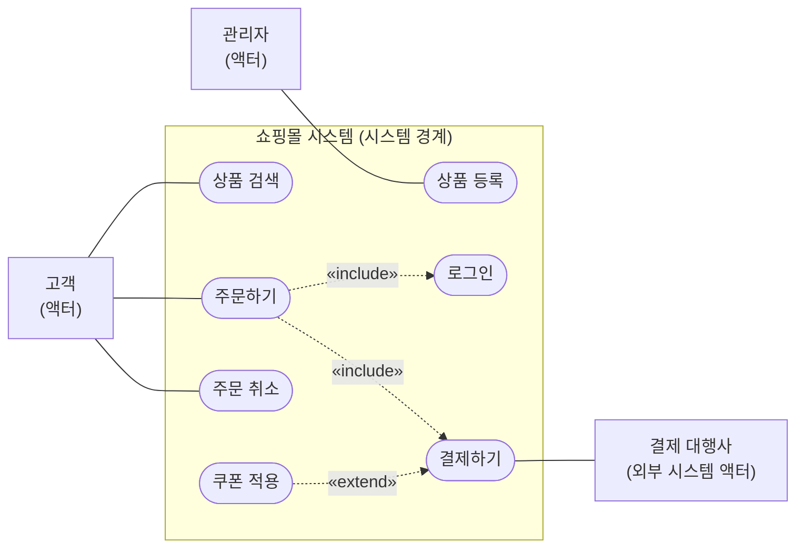
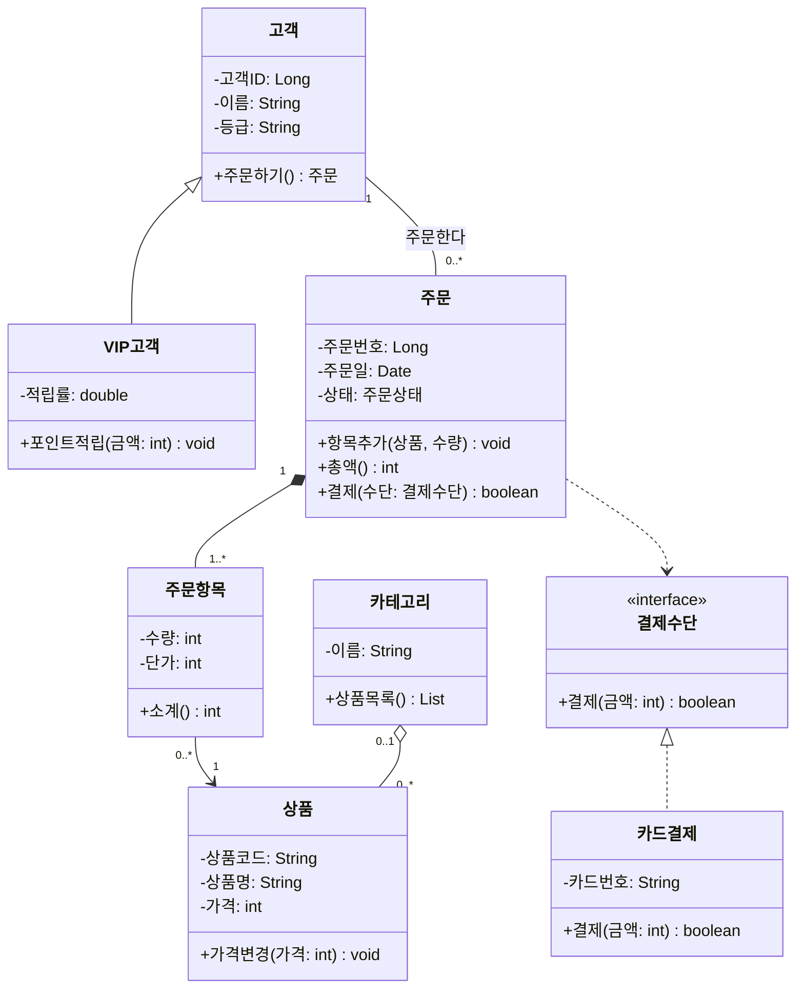
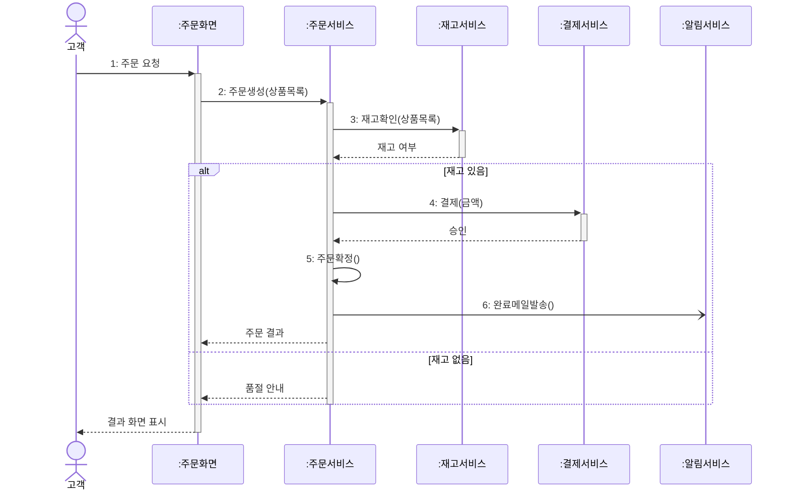
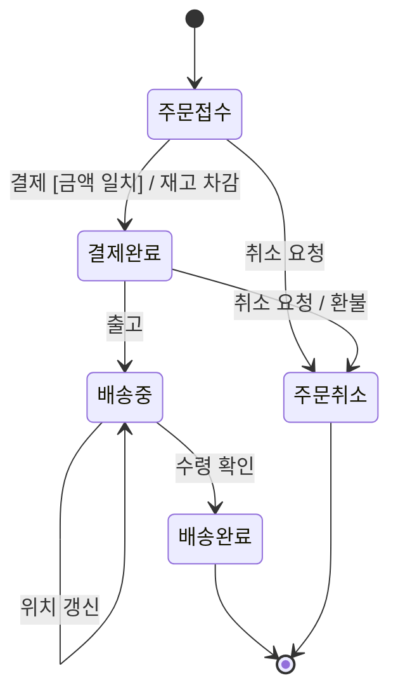
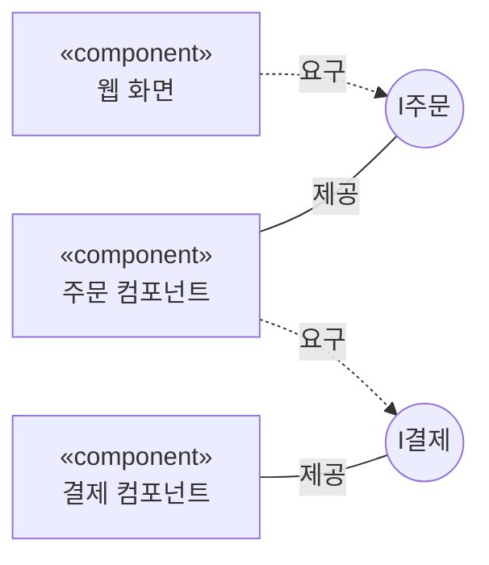
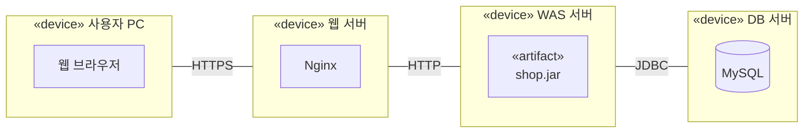

---
tags:
  - seed
aliases:
  - UML 예제
created: 2026-10-06
---
# TOPCIT UML 예제

- [[TOPCIT]] 노트 1-3 설계의 UML 부분 예제
- 모두 온라인 쇼핑몰 "주문" 하나로 그림
- Mermaid라서 옵시디언에서 바로 그려짐. 단, Mermaid가 지원하지 않는 UML 기호는 비슷한 모양으로 대신함 → 각 다이어그램의 **표기 차이** 참고
- 정확한 UML 기호로 그린 원본: [UML 다이어그램 예제 페이지](https://claude.ai/artifact/X3z1TZ1umCJRpqfa8cWVFM)

## 유스케이스 다이어그램
- 사용자(액터)가 시스템으로 무엇을 할 수 있는지 = 기능 요구사항

- «include»: 기본 → 포함 방향, **항상** 실행 (주문하기 → 로그인)
- «extend»: 확장 → 기본 방향, **조건부** 실행 (쿠폰 적용 → 결제하기)
- 표기 차이: 실제 UML은 액터 = 사람 모양, 유스케이스 = 타원

## 클래스 다이어그램
- 클래스의 속성·연산과 클래스 사이 관계 (정적 구조)

| Mermaid 문법 | UML 기호 | 의미 |
| --- | --- | --- |
| `A -- B` | 실선 | 연관 |
| `A --> B` | 실선 + 열린 화살표 | 방향 있는 연관 |
| `A o-- B` | 빈 마름모 (A = 전체) | 집합: 부분이 독립적으로 존재 |
| `A *-- B` | 채운 마름모 (A = 전체) | 합성: 전체가 사라지면 부분도 |
| `A <\|-- B` | 실선 + 빈 삼각형 (A = 부모) | 일반화(상속) |
| `A <\|.. B` | 점선 + 빈 삼각형 (A = 인터페이스) | 실체화(구현) |
| `A ..> B` | 점선 + 열린 화살표 | 의존 |
| `"1"`, `"0..*"` | 다중성 | 상대 객체 개수 |

- 다중성은 **상대편 끝**에 적음: 고객 "1" -- "0..*" 주문 → 고객 한 명은 주문 0개 이상
- 접근 제어: `+` public, `-` private, `#` protected, `~` package

## 시퀀스 다이어그램
- 시나리오 하나에서 객체들이 주고받는 메시지를 시간 순서(위 → 아래)로

| Mermaid 문법 | UML 기호 | 의미 |
| --- | --- | --- |
| `->>` | 실선 + 채운 화살촉 | 동기 메시지 (응답을 기다림) |
| `-)` | 실선 + 열린 화살촉 | 비동기 메시지 (안 기다림) |
| `-->>` | 점선 | 응답 메시지 |
| `+` / `-` | 활성 박스 | 처리 중인 구간 시작 / 끝 |
| `alt` / `else` | 결합 단편 | 둘 중 하나 (opt = 조건 맞을 때만, loop = 반복) |

## 활동 다이어그램
- 일의 흐름, 분기, 병렬 처리. 스윔레인으로 담당 주체 구분

```mermaid
flowchart TB
    subgraph L1["고객"]
        S((" ")):::startNode --> A1("장바구니에 담기") --> A2("주문서 작성")
        A4("품절 안내 확인") --> E1((("종료")))
    end
    subgraph L2["쇼핑몰 시스템"]
        A3("재고 확인") --> D{"재고?"}
        A5("결제 요청")
        FORK["포크"]:::bar
        B1("주문 확정")
        B2("확인 메일 발송")
        JOIN["조인"]:::bar
        E2((("종료")))
    end
    subgraph L3["결제사"]
        A6("결제 승인")
    end
    A2 --> A3
    D -->|"[재고 없음]"| A4
    D -->|"[재고 있음]"| A5
    A5 --> A6
    A6 --> FORK
    FORK --> B1
    FORK --> B2
    B1 --> JOIN
    B2 --> JOIN
    JOIN --> E2
    classDef bar fill:#333,stroke:#333,color:#fff
    classDef startNode fill:#333,stroke:#333
```

- 결정(마름모)은 **한쪽만**, 포크(막대)는 **모두 동시에** 진행. 조인은 모두 끝나야 합류
- 표기 차이: 실제 UML의 포크·조인은 굵은 막대, 스윔레인은 나란한 세로 구역. Mermaid에선 검은 상자와 묶음 상자로 대신함

## 상태 다이어그램
- 객체 하나(주문)가 이벤트에 따라 거치는 상태

- 전이 레이블 = `이벤트 [가드] / 액션`
- `[*]` = 초기 상태 / 최종 상태
- 활동은 "무슨 일을 하나", 상태는 "객체가 어떤 상태인가"

## 컴포넌트 다이어그램
- SW 부품과, 부품끼리 인터페이스로 맺는 의존 관계

- 표기 차이: 실제 UML은 제공 인터페이스 = 롤리팝(막대 끝 원), 요구 인터페이스 = 소켓(반원). 롤리팝 쪽이 구현(제공)

## 배치 다이어그램
- 하드웨어 노드와 그 위의 SW(아티팩트), 노드 간 통신

- 표기 차이: 실제 UML의 노드는 3D 박스
- 컴포넌트 = 논리적 SW 구조, 배치 = 물리적 서버 배치

## 헷갈리는 짝
| 짝 | 구분 기준 |
| --- | --- |
| «include» vs «extend» | 항상 vs 조건부. 화살표 방향 반대 (기본 → 포함 / 확장 → 기본) |
| 집합 vs 합성 | 생명주기 독립 vs 종속. 빈 마름모 vs 채운 마름모, 둘 다 전체 쪽 |
| 일반화 vs 실체화 | 상속 vs 인터페이스 구현. 실선 vs 점선, 둘 다 빈 삼각형 |
| 연관 vs 의존 | 필드로 계속 참조 vs 메서드 안에서 잠깐 사용. 실선 vs 점선 |
| 동기 vs 비동기 | 응답을 기다림 vs 안 기다림. 채운 화살촉 vs 열린 화살촉 |
| 결정 vs 포크 | 한쪽만 vs 모두 동시. 마름모 vs 굵은 막대 |
| 활동 vs 상태 | 작업의 흐름 vs 객체 하나의 상태 변화 |
| 컴포넌트 vs 배치 | 논리적 SW 구조 vs 물리적 서버 배치 |
